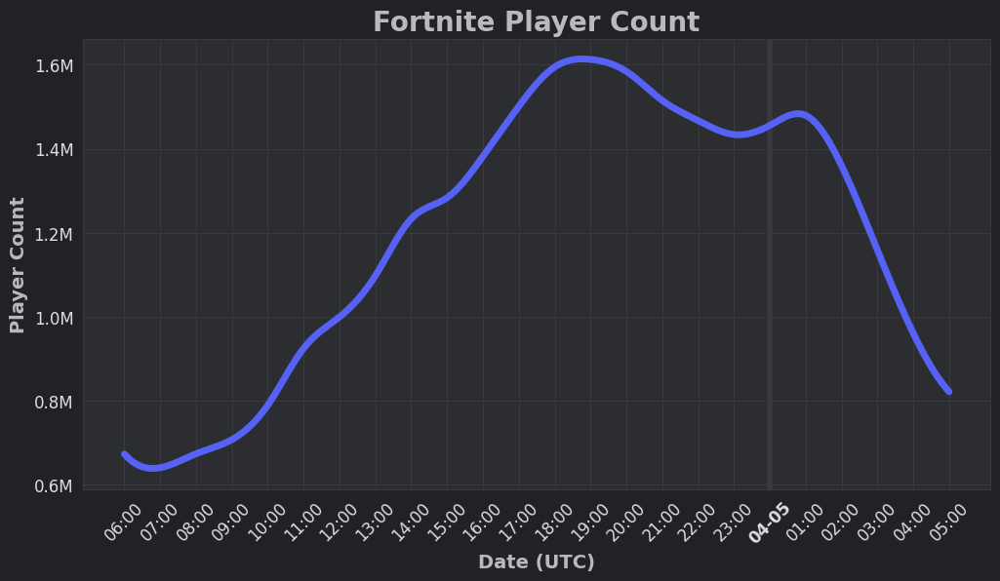
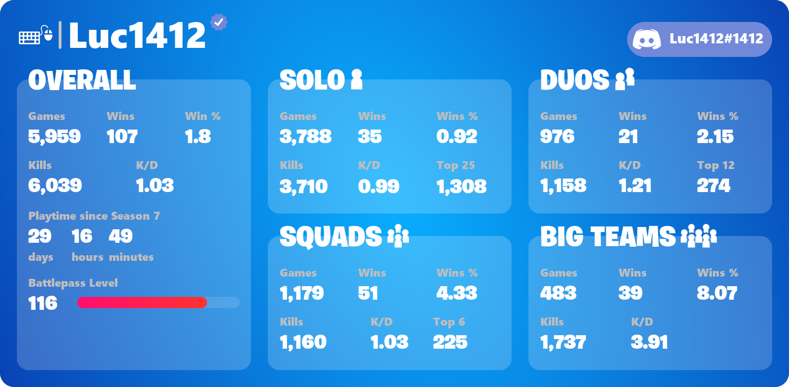

# Changelog

## V3.6.0 - 2023-12-XX \[BETA]

### Additions

* Added support for LEGO Fortnite:
  * Generate worlds with `/account lego generate` and delete them with `/account lego delete`
  * Manage access to your worlds with `/account lego share-key` and `/account lego remove-key` to add or remove key holders who can play at any time.
  * Gain a comprehensive overview of your LEGO Fortnite worlds with `/account lego list`, providing information on settings, total playtime, key holders, and currently playing players.
* Introduced the new `/account redeem-code` command for effortless code redemption within Discord
* Added `/account friends overview` for a comprehensive view of your friends
* Added the `/island` command, offering a comprehensive overview of creative islands, complete with the current player count. This command supports island searches by Name, Tag, and Code

### Changes/Improvements&#x20;

* Reworked Server Status:
  * Now includes Crew, Fortnite Lego, Rocket League Racing, and Fortnite Festival status
  * Shifted to using Discord timestamps for a more accurate countdown, eliminating the need for frequent updates every few minutes
* Enhanced the calculation of player count for the `/player-count` command again by including more maps, resulting in an even more accurate representation of active players
* The bot will no longer respond when replying to its messages, only when mentioned

### Fixes

* Resolved an issue preventing creator code info from appearing for premium users on the `/account battlepass buy-levels` command
* Fixed a bug causing Fortnite player searches to not function as expected (e.g., the `/stats` command).
* Addressed an issue occurring when a user attempted to add themselves as a friend
* Corrected the gift requirement to be set at 2 days instead of 3
* Fixed issues with the account system after deleting user data with the `/data user delete` command
* Resolved an issue where users were being logged out during server issues with Epic Games servers
* Fixed a bug causing the shop to be sent again, even though no visible item was changed
* Fixed a bug where some emotes may appear multiple times
* Fixed an issue preventing a return to already viewed cosmetic selections in locker
* Fixed an issue preventing changing pages in the locker
* Resolved a bug where the shop image failed to include the section title, leading to a misalignment of items displayed in an extended, single row. <mark style="color:purple;">\[Hotfixed in V3.5.1]</mark>

## V3.5.1 - 2023-11-06

### Additions

* Implemented a small account overview feature that activates when an already logged-in user utilizes the `/account login` command. This provides users with a quick summary of their account details for added convenience and awareness.

### Changes/Improvements

* Not linked users can now use the `/stats` command with the added option to directly link their account, eliminating the need for an additional `/link` command.
* When setting or changing channels or roles in the settings, the selected values are now consistently displayed, providing users with clear confirmation of their choices.
* Updated the locker account value formula from 1$ = 125 V-Bucks to 1$ = 111 V-Bucks to align with recent [changes in V-Bucks pricing](https://www.fortnite.com/news/upcoming-fortnite-pricing-alignment-in-czech-republic-denmark-eurozone-countries-united-states-and-more-in-october-2023). <mark style="color:purple;">\[Hotfixed in V3.5]</mark>
* Added a note to the `/account locker` command explaining how the locker value is determined, providing users with transparency and clarity.
* Enhanced the calculation of player count for the `/player-count` command by including more maps, resulting in a more accurate representation of active players.
* Changed the Creator Code command from `/account creator-code` to `/account creator-code set` for future-proofing and clarity in command usage.
* Premium users now have the ability to select a creator code before making purchases trough the account system
* Implemented various optimizations to enhance overall system performance, ensuring a smoother and more efficient user experience.

### Fixes

* Resolved an issue where users could unintentionally receive premium benefits after ending their subscription through Discord
* Addressed timeouts occurring in the `/account` commands, where the application failed to respond.
* Fixed a problem with bundle discounts in the `/account buy` command; when users already possessed most items in a bundle, it now correctly displays and offers the bundle at the minimum price.
* Rectified a rare occurrence where the shop would appear multiple times.
* Eliminated the occurrence of creator code ads appearing when premium users purchased items through the bot.
* Corrected game mode-specific player counts not updating and inaccurate peak player counts.
* Resolved users getting stuck after encountering an error message during account login.
* Implemented a workaround for account commands to consistently fail for a small subset of players.
* Improved the error messaging for specific cases in the `/account battlepass buy-levels` command.
* Fixed delays in the `/account shop` commands, ensuring the latest items are promptly displayed.
* Addressed an issue where an error message was shown instead of proper information when using `/account shop gift` without selecting a valid friend.
* Fixed an issue causing an error message when users searched for refundable items without recent purchases.
* Rectified display issues with refundable items in `/account shop refund` <mark style="color:purple;">\[Hotfixed in V3.5]</mark>
* Corrected the prevention of the shop from being updated <mark style="color:purple;">\[Hotfixed in V3.5]</mark>
* Fixed the unavailability of gift selection <mark style="color:purple;">\[Hotfixed in V3.5]</mark>
* Resolved issues with the Shop command when executed by users with a different language setting than the server, ensuring premium elements display correctly <mark style="color:purple;">\[Hotfixed in V3.5]</mark>
* Fixed premium rights distribution to Patreon subscribers due to the introduction of free Patreon memberships <mark style="color:purple;">\[Hotfixed in V3.5]</mark>
* Rectified the Shop command in DMs <mark style="color:purple;">\[Hotfixed in V3.5]</mark>
* Addressed inflated numbers in the `/player-count` command <mark style="color:purple;">\[Hotfixed in V3.5]</mark>
* Corrected the `/account battlepass buy` command for the new season following significant changes  <mark style="color:purple;">\[Hotfixed in V3.5]</mark>

## V3.5 - 2023-08-27

### Additions

* **New Ranked Stats:**
  * Build and Zero Build Rank with progress tracking
  * Unreal Global Ranking
  * Lifetime Competitive Stats expansion: now includes Ranked Stats, Tournament Stats and Legacy Arena Stats

<figure><figcaption>
New Competitive Stats including Ranked
</figcaption></figure>

* **Discord App Premium Integration:**
  * Subscription is now available both via the Bot's profile and the [App Directory](https://ptb.discord.com/application-directory/444203099331231746)
  * Subscription pricing remains the same ($5 + tax). However, a $0.5 discount is applied on Patreon to offset fees
  * Enhanced view for the Premium overview
* Added a feature to the `/drop` command: users can now choose only named locations. _\[Suggested by `@fhl09`]_

### Changes/Improvements

* **Stats Commands Overhaul:**
  * Stats commands now mandatorily require the `player` option. This lets users select the linked account or Discord user or search for a player
  * The input type option and pre-selection has been removed, instead the accumulated Global input is selected by default
* **Streamlined Account Linking:**
  * The Link and Verify processes have been merged into a single system. Users simply need to open the EpicGames verification page
* Disabled the account verification feature in the account system due to its confusing nature and potential misuse by account traders
* Revamped the `/help` command by introducing new icons and incorporating previously missing commands from the Account and Misc categories
* Enhanced the `/cosmetics` command's shop history feature, which now organizes consecutive days to provide a more coherent and concise overview
* Optimized the message output for the `/event` command to offer a more refined and informative experience

### Fixes

* Addressed an unresponsiveness issue (resulting in an "interaction failed" error) occurring during specific time periods
* Rectified an error encountered when utilizing the `/account refund` and `/account undo` commands in cases where a user had no recent purchases
* Resolved an issue that was preventing the initial message from being sent after configuring the item shop, server status, or news
* Corrected an issue that caused unintended information to be included in automated item shop or server status posts, potentially leading to advertisements in premium server messages
* Enhanced the error message handling for the `/account shop gift` command to provide clarity when a player is ineligible for gifting
* Adjusted the shop image stroke for discounted prices

## V3.4.1 - 2023-06-09

This updates focuses on Bugfixes and Improvements for the recently introduced Account System

## Additions

* Introduced new commands for Battle Pass and additional levels:
  * `/account battlepass buy`: Purchase the Battle Pass or the Battle Bundle (Battle Pass + 25 levels)
  * `/account battlepass buy-levels`: Purchase additional Battle Pass levels. Discounts, like the 25 level bundle, are automatically applied

### Changes/Improvements

* Updated`/account info`:
  * Added information about Supercharged XP
  * Included the number of purchased Battle Pass levels
  * Added a level progress bar to display the current XP
  * Provided information about current and past bans
  * Simplified the Season section&#x20;
* Simplified responses for the `/data server get` and `/data user get` commands
* Made volume selection persistent in the radio menu, eliminating the need for a separate button
* The Bot now displays users who choose a new username without the `#0` at the end

### Fixes

* Deployed over 50 fixes for the new account system introduced in V3.4.0. The system now works well with only minor quirks
* Fixed a major issue that could blocked users from accessing any `/account` command for an hour
* Fixed issue that friend related commands autocomplete doesn't work, which prevented users from accessing these
* Fixed issue that prevent users from gifting items, due to a bugged gift wrap selection
* Fixed the text in `/account shop gift` command when gifting an item.
* Fixed `/data user get` for users that are logged in to the account system
* Fixed issues with the Gift History in `/account info`
* Fixed error which appeared in some cases when purchasing something with an insufficient amount of V-Bucks

## V3.4.0 - 2023-04-21

This patch is the finalize the migration from prefixed commands (e.g. `!fn shop`) to slash commands (e.g. `/shop`).

### Additions

* Added new Account Management System \[BETA]: This new System allows you to manage your Fortnite Account right from Discord
  * `/account login` - Login into your Fortnite account
  * `/account locker` - View your locker items, filter them and check your account value
  * `/account info` - Get an overview of your account
  * `/account claim-daily` - Claim your daily Save the World reward
  * `/account creator-code` - Set your current creator code
  * `/account shop buy` - Buy an item from the item shop
  * `/account shop gift` - Gift an item from the item shop to a friend&#x20;
  * `/account shop undo` - Undo a recent purchase
  * `/account shop refund` - Refund a purchase using a refund token
  * `/account friend add` - Add a player as a friend
  * `/account friend remove` - Refund a purchase using a refund token
  * With more coming soon including: Friends overview, Auto Creator Code, Auto Daily Claiming

<figure><figcaption></figcaption></figure>

* Added new `/player-count` command that's displays the current and past player count history

<figure><figcaption></figcaption></figure>

* Added a new `/image` command to manage images for premium custom backgrounds
* Added [discordlist.gg](https://discordlist.gg/bot/444203099331231746) support

### Changes/Improvements

* **Reworked Item Shop image:** Item Shop image has been reworked. This now looks similar to the game.
  * Readability has been improved by decreasing the vertical size accomplished by the new form factor and split
  * Shop Categories, Bundle discounts and an icon referring to special items had been added
  * Creator Code visibility has been improved

<figure><figcaption></figcaption></figure>

* Source for cosmetics in `/cosmetics` are now available for almost any item, however just in English
* Radio stability has been improved. Especially 24/7 mode works now more reliable.
* Item shop image, stats image, season progress bar image and drop image generation speed have been improved
* All mentions of commands are now clickable. When you click on them you can execute the command directly
* Setting up automatic updates like Item Shop, News, etc. has been temporarily changed to dropdown menus.
* Setting custom creator codes now works via a modal, a popup with a text field.
* Changing premium custom background is now accomplished by a dropdown menu. These image can be managed with `/image`&#x20;
* Rework `/event` command. It now include better timestamps and includes all events.
* Improved volume selection for radio
* Improved handling of prompts which require to confirm and possible follow-up messages
* Improved button menus that cause fewer problems and improve performance

### Fixes

* Fixed error message when activating nick stats although another nick stats type is already enabled
* Fixed an issue that caused data to not be saved properly, resulting in data loss or delayed availability
* Fixed arena hype lookup
* Improve overall performance by reducing the high workload caused by background tasks
* Users who use Portuguese (Brazil) language, some parts of the bot were displayed in normal Portuguese. This issue has been fixed.
* Fixed `/drop` image markers being off due to a change in Season 2

### Removals

* All prefixed commands (commands starting with `!fn`, such as `!fn shop`) have been removed. The bot now works exclusively with slash commands
* Removed support for custom prefixes for premium users. This change is accompanied by the removal of prefixed commands.
* Remove Challenge related features
* Remove [discordlist.space](https://discordlist.space) support due to shutdown

## V3.3.2 - 2022-06-15

This patch is an emergency fix due to recent bot crashes.


Discord extended the Slash Command enforcement until 09/01/2022. Our migration period has been extended until 08/01/2022. This date marks the end of the availability of text commands. (eg.`!fn shop`)


### Additions

* Added `/fn` command which will be suggested by Discord when using the text commands on Desktop.
* Added support for multi-language for the item shop

### Changes/Improvements

* Improve player name-check when using the stats command without autocomplete

### Bugfixes

* **The bot crashed in the past while generating the shop occasionally. This sometimes caused complete bot crashes after a few hours.**
* Fix `/shop` command if a user set their Discord language to Japanese and Korean
* Shop images now show Japanese, Korean, and Russian characters correctly
* Fix `/info`, `/server-status`, `/stats`, `/shop`  command in DMs
* Fix `/radio`, `/nickstats` command being available in DMs. These commands now only show up on servers.
* Fix buttons in the stats menu sometimes failing

## V3.3.1 - 2022-05-17

This patch mainly contains under-the-hood changes that implement recently released Discord features.

### Additions

* Implemented Discords new [Command Permissions System](https://discord.com/blog/slash-commands-permissions-discord-apps-bots) available under `Server Settings -> Integrations -> EasyFortniteStats`
  * `/setup`, `/settings`, `/data` commands are only available for members with Manage Server permissions

### Changes/Improvements

* The stats command's name option now provides search functionality for Fortnite Player names.
  * This function supports searching for EpicGames, Xbox Live, and Playstation Network player names.
  * EpicGames player IDs are also supported
  * Alternatively, you can enter a name or ID without selecting an option.
* The `/radio` command can now be used without selecting a radio station in the command itself. Instead, a dropdown selection is shown. This is especially useful when just resuming a radio session.
* The `/radio` menu always shows a dropdown for switching the radio station, instead of going through 2 steps.
* We fixed a performance lack which should result in better performance and should reduce "Interaction doesn't respond" error messages
* Improved stats image creation speed
* Most commands have been enabled in direct messages
* Selecting a player name and a Discord user at the same time in the `/stats` command now results in an error message for clarification.
* Improved a few messages to make things clear

### Fixes

* Fixed an issue that caused an endless loading state when retrieving your stats or linking your account
* Premium enabled server wasn't able to use the `/data` server commands.
* Fixing issue problems when interacting with the radio menu while the bot is disconnected&#x20;

## V3.3.0 - 2022-02-01


This update introduces a 3 month transition period from normal Text Commands (eg.`!fn shop`) to the new Slash Commands (eg.`/shop`). On 04/01 all text commands will finally be disabled.


### Additions

* Added support for [Slash Commands](https://support.discord.com/hc/en-us/articles/1500000368501-Slash-Commands-FAQ). All previously available commands are available as normal commands and slash commands.
  * Some command error messages are now [Ephemeral Messages](https://support.discord.com/hc/en-us/articles/1500000580222-Ephemeral-Messages-FAQ), which will only be shown to the user who invoked the command
  * The `/stats` provides a list of available input types.
  * `/challenges` now provide you a list of available weeks for the optional week argument
  * `/news` now provides the list of modes to select from
  * `/radio` provides you the list of available radio stations
  * Instead of having individual `!fn bplvl` or `!fn wins` commands, the slash command implementation uses `/nick-stats`. This also provides a list of available types.
  * `!fn seasoninfo` command was renamed to `/season` as a slash command
* Added a Context User Command which allows receiving the stats of a specific user. Just right-click a user in your server -> Click ''Apps" -> Select "User Stats"
* Added `/cosmetics` Command which provides details about a specific cosmetic.
  * This command is only available as a slash command
  * Cosmetic Names can be autocompleted
  * Pro mode command option available. This will provide more details often useful for leaks.
* Added an option to `/settings` that allow the bot to prefer the user's language over the server language. Active by default.
* Nick Stats now support Arena Hype using `/nickstats stats-type:Arena Hype points`
* Added game-info argument to `/season` command. This provides general information about the game. \[Slash command only]

### Changes/Improvements

* Improved speed of receiving stats
* When using a text command the bot replies to the user's command.

### Fixes

* Fixed error which blocked creative news setup
* Fixed error which occasionally when pre-selected an input type and switching the stats type which didn't have stats for the desired type yet
* Fixed issue that the bot doesn't respond if selecting an input type which the player never played with
* Fixed an error that was raised when using a quote like character in the stats text command (eg. `"`, `‘`, `《`)
* Fixed error which occurred when setting up automatic updates and providing an invalid channel or role and the bot got no permissions to respond
* Fixed rare issue which caused an error when starting the radio
* Fix rare issue which breaks the auto channel setup

## V3.2.1 - 2021-10-23

### Changes/Improvements

* Switched the verification System: The new verification isn't based anymore on accepting a friend request and providing a 4-digit code. Now you just need to log in with your account on the EpicGames website and need to authorize EasyFortniteStats to verify your account
* Temporarily disabled the challenges command, due to the new challenges format which has been introduced in Season 8.
* Reduced radio quality from 384kb to 128kb for a more stable experience

### Fixes

* Fixed problem which caused that the verification stopped when clicking the checkmark icon in direct messages
* Fixed a problem caused that other users were able to interact with buttons from commands invoked by other users.
* Fixed an error that occurred when using `!fn challenges [week]` with a non-number argument for the week.&#x20;
* Fixed an issue that news wasn't updated properly
* Fixed possible errors which occurred while setting up a bot feature and messages were already deleted
* Fixed a problem which caused that the hype amount displayed where wrong.
* Fixed problem which didn't fully respect pre-seasons and may caused displaying the wrong arena hype value

## V3.2.0 - 2021-09-04

### Additions

* Added support for [Discord's new buttons](https://support.discord.com/hc/en-us/articles/1500012250861-Bots-Buttons). Following features support buttons:
  * Challenges (including seamless switching between weeks)
  * Stats (including seamless switching between input types and stats types eg. Lifetime)
  * News (including seamless switching between Gamemodes eg. BattleRoyale)
  * Radio (more details below)
  * Map (shortcut to open the map in full quality)
  * Drop (generate a new location with just one click)
  * Help (more details below)
  * Confirming (Verification, Data deletion)
  * Settings (General, Shop, Challenges, ServerStatus)
  * Voting (Shortcut to open main Vote page)
* Automated News Updates: News can now get automatically posted into a specific channel like challenges or the item shop. This feature can be set up with `!fn news settings`
* Radio Stable Release: Radio has been now finally been implemented. It's more stable and less buggy. All subcommands have been removed. Only `!fn radio` is needed to open the player which lets you manage the bot with the new buttons.
  * Added 24/7 Playback for **premium users**🔸
  * Due to the extra required resources, volume control is only available to **premium users** 🔸
* Help rework: The help command has been fully reworked and now supports buttons and dropdown menus.
  * Commands are now sorted into categories
  * Categories can be navigated with a dropdown menu
  * A bot news section has been added to the help command
* Settings Rework: Settings have been redesigned with buttons. Also `!fn settings` is now a place to reach all bot settings including Shop, Challenges, etc.
* Stats now let you select an account if there are multiple accounts with the same name
* Added `!fn review` to show off all pages to review the bot.&#x20;
* After setting up automatic updates, initially all data is sent into the channel. (latest shop, current seasons cheat cheats, etc.)

### Changes/Improvements

* The bot doesn't require the "Add Reactions" permission anymore
* The general bot speed has been optimized
* Dates and Times shown by the bot are now based on your timezone
* Countdowns/Relatives Dates/Times now automatically updated

### Fixes

* Fixed that Arena Hype was reset too early for most users&#x20;
* Fixed a few wrong terms and typos
* Nick Stats setup has been fixed
* Fixed mentions in shop updates

## V3.1.0 - 2021-05-21

### Additions

* Competitive Stats: Get just your Arena and Tournament matches including Arena Hype, Division, Earnings, and FortniteTracker.com's Power Ranking (`!fn comp`)

* Seasonal Stats: Only display the stats that you have earned in the current season. (`!fn season`)
* Season Command: View info on the current season and progress (`!fn seasoninfo`)
* Added Trio Stats in Stats image
* Added Privacy Policy: [https://www.easyfnstats.com/privacy](https://www.easyfnstats.com/privacy/)
* Added support for server and user data deletion (`!fn data server delete`, `!fn data user delete`)
* The Bot has been added to [https://discordextremelist.xyz/](https://discordextremelist.xyz/en-US/bots/fortnite)

### Changes

* Reformatted Stats Image

.png>)

* Moved FAQ to docs (`!fn faq`)

### Fixes

* Fixed issue that selections work when adding the same reaction in another channel
* Fixed issue that bot lobbies still included
* Fixed verification error message if an account is claimed
* Fixed shop command which doesn't work in rare cases
* Fixed issue that the shop image is sometimes missing
* Fix that BattlePass level progress bar broken on too small progress
* Fix reaction doesn't work on verification start

## V3.0.0 - 2021-03-08

V3 is a complete overhaul of V2. The source code has been 100% re-written and nothing was copied from the old Bot. This causes that all bugs from old versions to get fixed. V3 offers a fresh new feel and look without being unfamiliar.

### Additions

* Account Verification: Verify that you own a specific account and get benefits (`!fn verify`)
* Nick Stats: Show off your BattlePass level or wins in your nickname. More types coming soon! (`!fn bplvl`, `!fn wins`)
* Global Stats: You now can now also get all stats from all different input types combined
* News: The bot now supports BattleRoyale and Creative in-game news (`!news`, `!news creative`)
* Fortnite Radio: Listen to the Fortnite in-game radio channels live in Discord. (`!fn radio`)
* Fortnite Shop now supports multiple languages
* Stats image now show off how often you placed Top 25
* Premium now will be automatically granted and can be en/disabled through a command (`!fn premium`)
* All reaction/text menus have been overhauled. You also can react during reactions are getting added
* `!fn challenge` now takes a `[week]` parameter for quick access eg. `!fn challenges 3` :arrow\_right: Shows the week 3 challenge cheat
* User with `Manage Server permission` can now also modify the bot
* `!fn cluster` command for Cluster overview
* `!fn data` command to receive the data saved by the bot
* Prefix setting for **Premium** users (`!fn settings`)

### Changes

* Changed the Stats calculation.&#x20;
  * More LTM stats and Trio are now included in Stats Calculation
  * Bot Lobby rounds are no more counted
* New Stats image design (`!fn stats`)&#x20;

* New Item Shop image design (`!fn shop`)

* `!fn challenges` now support up to 15 instead of 10 weeks
* `!fn drop` has been overhauled by adding more locations that get automatically updated. Also, the location gets marked on the map.&#x20;
* The Information shown in `!fn info` was updated
* Updated the `!fn event` command with the latest events

### Fixes

* Instability issues have been resolved. Crashes or timeouts should now be rarer.
* No, half or wrong challenge images were shown
* No more "Please finish your last action before you can execute another command." :tada:&#x20;

### Removals

* Score, Average Kills, and Stats won't be displayed anymore, because they were irrelevant or duplicated&#x20;
* Support for getting stats from other members by Name#Tag (This change was made due to Discord limitation and may be changed when Discord add an alternative way)
* Removed Danish and Ukraine due to missing translator and low demand&#x20;
