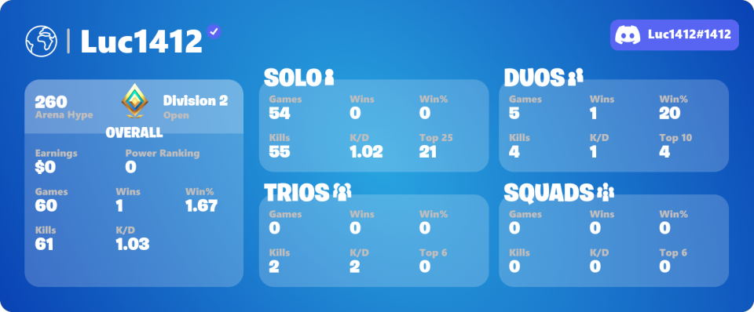
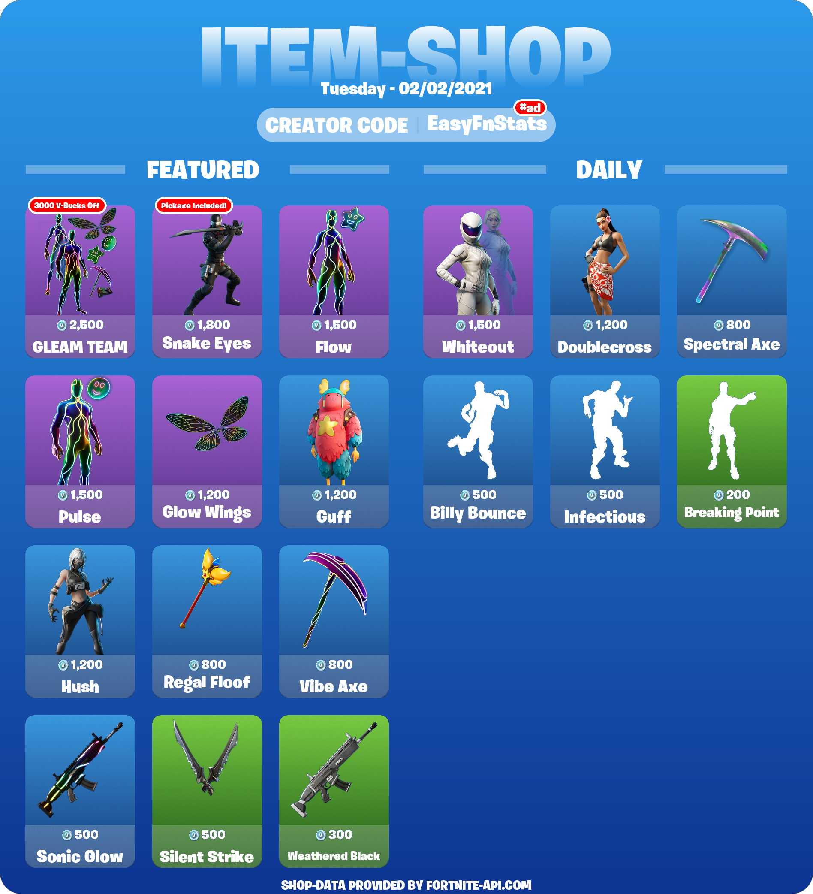

# Changelog

## V3.1.0 - 2021-05-21

### Added

* Competitive Stats: Get just your Arena and Tournament matches including Arena Hype, Division, Earnings, and FortniteTracker.com's Power Ranking \(`!fn comp`\)

* Seasonal Stats: Only display the stats that you have earned in the current season. \(`!fn season`\)
* Season Command: View info on the current season and progress \(`!fn seasoninfo`\)
* Added Trio Stats in Stats image
* Added Privacy Policy: [https://www.easyfnstats.com/privacy](https://www.easyfnstats.com/privacy/)
* Added support for server and user data deletion \(`!fn data server delete`, `!fn data user delete`\)
* The Bot has been added to [https://discordextremelist.xyz/](https://discordextremelist.xyz/en-US/bots/fortnite)

### Changed

* Reformatted Stats Image

* Moved FAQ to docs \(`!fn faq`\)

### Fixed

* Fixed issue that selections work when adding the same reaction in another channel
* Fixed issue that bot lobbies still included
* Fixed verification error message if an account is claimed
* Fixed shop command which doesn't work in rare cases
* Fixed issue that the shop image is sometimes missing
* Fix that BattlePass level progress bar broken on too small progresses

## V3.0.0 - 2021-03-08

V3 is a complete overhaul of V2. The source code has been 100% re-written and nothing was copied from the old Bot. This causes that all bugs from old versions to get fixed. V3 offers a fresh new feel and look without being unfamiliar.

### Added

* Account Verification: Verify that you own a specific account and get benefits \(`!fn verify`\)
* Nick Stats: Show off your BattlePass level or wins in your nickname. More types coming soon! \(`!fn bplvl`, `!fn wins`\)
* Global Stats: You now can now also get all stats from all different input types combined
* News: The bot now supports BattleRoyale and Creative in-game news \(`!news`, `!news creative`\)
* Fortnite Radio: Listen to the Fortnite in-game radio channels live in Discord. \(`!fn radio`\)
* Fortnite Shop now supports multiple languages
* Stats image now show off how often you placed Top 25
* Premium now will be automatically granted and can be en/disabled through a command \(`!fn premium`\)
* All reaction/text menus have been overhauled. You also can react during reactions are getting added
* `!fn challenge` now takes a `[week]` parameter for quick access eg. `!fn challenges 3` ➡ Shows the week 3 challenge cheat
* User with `Manage Server permission` can now also modify the bot
* `!fn cluster` command for Cluster overview
* `!fn data` command to receive the data saved by the bot
* Prefix setting for **Premium** users \(`!fn settings`\)

### Changed

* Changed the Stats calculation. 
  * More LTM stats and Trio are now included in Stats Calculation
  * Bot Lobby rounds are no more counted
* New Stats image design \(`!fn stats`\) 

* New Item Shop image design \(`!fn shop`\)

* `!fn challenges` now support up to 15 instead of 10 weeks
* `!fn drop` has been overhauled by adding more locations that get automatically updated. Also, the location gets marked on the map. 
* The Information shown in `!fn info` was updated
* Updated the `!fn event` command with the latest events

### Fixed

* Instability issues have been resolved. Crashes or timeouts should now be rarer.
* No, half or wrong challenge images were shown
* No more "Please finish your last action before you can execute another command." 🎉 

### Removed

* Score, Average Kills, and Stats won't be displayed anymore, because they were irrelevant or duplicated 
* Support for getting stats from other members by Name\#Tag \(This change was made due to Discord limitation and may be changed when Discord add an alternative way\)
* Removed Danish and Ukraine due to missing translator and low demand 

