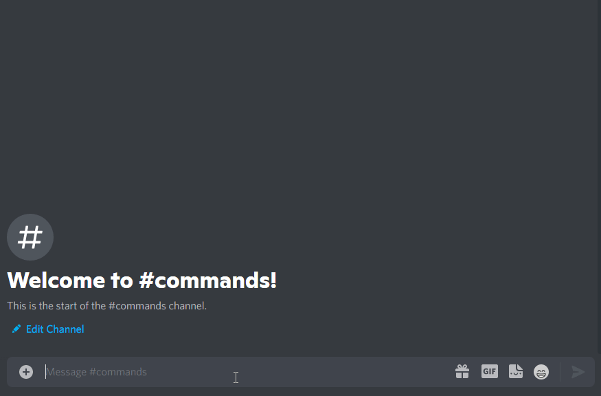

# FAQ

## General

### Why are the normal text commands no longer available?

On August 31, bots can no longer read all message content. This means that the bot no longer knows whether and which command was executed. This provides more privacy, but forces the messenger developers to switch to slash commands at the same time. Read more [here](https://support-dev.discord.com/hc/en-us/articles/4404772028055-Message-Content-Privileged-Intent-for-Verified-Bots).

### How do slash commands work?

You only need to type `/` in the chat window, which opens a menu with all available commands, sorted by bot. You just need to select the command of your choice. Read more [here](https://support.discord.com/hc/en-us/articles/1500000368501-Slash-Commands-FAQ) about slash commands.

### I can't see a slash command, how can I change that?

#### No Permissions

Users may not be able to use slash commands in this channel. For this, the users who should be able to use the commands must get the **Use Application Commands** permissions.&#x20;

### The bot doesn't respond, what can I do?

In most cases, this issue is caused by the wrong permission setup. The Bot requires 'View Channel' permissions in the channel you like to use the bot. If you are inexperienced you might grant Administrator permissions.

In rare cases, it might be caused by a bot restart or outage. If you checked the permissions and the bot doesn't answer for more than 10min feel free to contact us on [our support server](https://easyfnstats.com/discord).

### How can I disable certain commands?

Discord recently introduced the [Command Permissions System](https://discord.com/blog/slash-commands-permissions-discord-apps-bots). This allows you to allow or deny specific **Slash Commands** to certain roles, users or channels. To get started go to "Server Settings" -> "Integrations" -> "EasyFortniteStats" and modify the given settings.

## Stats

### &#x20;**My account was not found. What can I do?**

&#x20;Normally all accounts should be found. First, check if you might have a typo in your name. Also, if you are an Xbox or PlayStation 4 player, you may need to upgrade your Fortnite account on [https://epicgames.com/](https://epicgames.com/) to a full EpicGames account.

### &#x20;My stats are wrong. How can this be?

The bot retrieves the stats directly from EpicGames, so they can't be wrong. There might be a typo in your EpicGames, PlayStation Network, or Xbox Live account name, or a wrong account got selected. Also, it isn't possible to compare the stats with other sources, because the bot displays them differently.

### &#x20;My stats are not up to date. What is the reason?

EpicGames don't update the stats immediately after each match. You have to wait a bit until they update. Sometimes it may take up to multiple hours.

### &#x20;Why does it say "Playtime since Season 7"?

EpicGames introduced the feature to track playtime in Season 7. That's why it's only been tracked since Season 7 (even though you played earlier).

### Why is my Arena Hype not displayed?

Due to a limitation of EpicGames we are only able to display the Arena Hype of players who are either in the top 10.000 hype leaderboard or having a player name without a space character.

### What is the Power Ranking?

The Power Ranking, created by [Fortnite Tracker](https://fortnitetracker.com/), ranks the best players in the competitive field of Fortnite Battle Royale. The ranking is updated automatically every 24 hours and players move up based on their results in tournaments. Each tournament has a certain Tier, which is based on the competitive value of the tournament, the number of players, the format, and the prize pool. More Information [here](https://fortnitetracker.com/article/921/announcement-power-rankings-now-live).

### My Hype, Divison, Earnings, or Power Ranking isn't up to date. How can this be?

These values depend on FortniteTracker.com. It may take multiple hours to update your competitive data.&#x20;

## NickStats

### What happens when I change my name?

You can change your name at any time. You shouldn't write anything behind the stats value.

### How often is my stats value updated?

The stats value gets updated every 2 hours (1 hour for premium servers) by the bot. Other delays are caused by EpicGames.

### How do the wins get calculated?

All wins from all rounds where teams are not larger than 4 members are counted. (Excluding rounds with bots)

## Account System \[`/account`] 

### How does this system work?

With this feature, you can log into your Fortnite account through the bot. This way, you can manage it via Discord. Like any other bot with such a feature, the bot receives full access to the Fortnite account, as this is the only way to provide such features.&#x20;

This bears the risk that your account could be stolen by a third party hacking the bot or that we exploit these accounts for our advantage. This means that you have to trust our development team. The following sections explain why you can trust us and what measures we take to protect you and your account.

### Can I trust EasyFortniteStats?

Whether you can trust us or not is ultimately up to you. But we would like to list here what makes us so that you can trust us:

* EasyFortniteStats has been around since 2018 and since then we have always tried to offer our users the best possible experience.
* We take security seriously. Our server is secured according to the latest security standards. Additionally sensitive data, as your account data, is encrypted with military grade encryption
* The owner (@luc1412) is working with EpicGames to maintain the Discords bots in the [Official Fortnite Germany Discord](https://discord.gg/fortnitede)
* We are transparent and inform our users about possible risks and security measures

### Can I get banned for using it?

There are no known cases in recent years where players have been banned for using such a feature. In rare cases, accounts were temporarily disabled or passwords were reset. As long as you have full access to the account and its mail, you can always regain access to the account. We also have taken measures to prevent such annoyances.&#x20;

Bans can be imposed at most if bugs are exploited with the help of the bot (e.g. XP glitches). However, we actively choose not to make such exploits available.

### What does \[BETA] mean for this feature?

This feature is currently still in a beta testing phase, although it is available in the normal bot. This means all features are free to use. In the future we'll lock features behind an affordable premium subscription.

Also currently, we have only been able to test and optimized the feature based on a small number of accounts so far. We can't guarantee that it will work with every account at the moment, so we're making it publicly available for anyone interested so we can improve the bot. However, these errors can only restrict the function of the bot, but cannot cause any damage to your account.

### How do we handle our Creator Code?

We're pleased to advertise our Creator Code through the account feature. We appreciate every user who supports us as the costs associated with this feature have increased. Our Creator Code is only set with the user's knowledge and consent in the following scenarios:

* After the user logs in with `/account login` and confirms their consent
* If the user confirms their consent before purchasing or gifting items using the `/account shop` command, and only if no other code has been set
* If the user selects our code using the `/account creator-code` command
* If the code has expired and our code was the last one used, it will be renewed&#x20;

We prioritize transparency and user consent in all aspects of our platform and strive to provide a seamless and enjoyable experience for all users.

### What is the locker value and how do we determine it?

This isn't an exact representation on how much money you spent on Fortnite.

Instead we accumulate the Item Shop V-Bucks price of all items you own. So it won't respect any discounts e.g. when purchased in a bundle. The real money value is a conversion based on the current V-Bucks price (1$ = 111 V-Bucks). This price is based on the cheapest V-Bucks bundle (1000 V-Bucks for $8.99). This has been changed with the recent [price increase](https://www.fortnite.com/news/upcoming-fortnite-pricing-alignment-in-czech-republic-denmark-eurozone-countries-united-states-and-more-in-october-2023).
