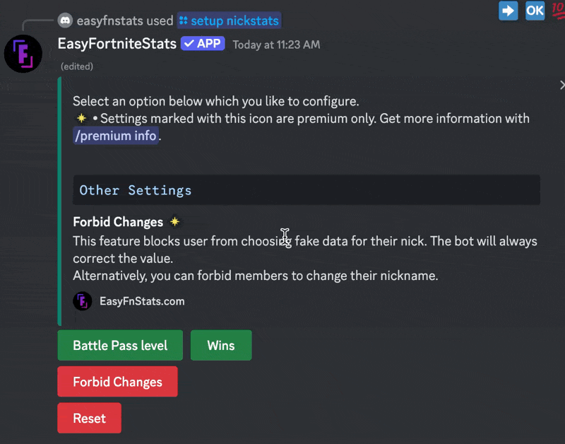

# Nick Stats

##  Premium Features

<details>

<summary>Faster Nick Stats Updates</summary>

Nick Stats will update every hour instead of every 3 hours, providing more timely information.

</details>

<details>

<summary>Restrict Nick Stats Changes</summary>

Prevent users from using fake stats in their nicknames. The bot will automatically reset any altered stats to the correct values.

</details>

## Modify Nick Stats settings

First, enter the following command. It doesn't matter if you like to set up BattlePass Level or Wins:&#x20;

```
/setup nickstats
```

### Enable/Disable Nick Stats

Depending on which Nick Stats type you like to set up you can press the appropriate button. Green means enabled, red means disabled.

<figure><figcaption></figcaption></figure>

###  Forbid Changes \[Premium only]

You can toggle this feature by pressing the button. Green means enabled, red means disabled.

<figure><figcaption></figcaption></figure>

## Reset Settings

You can also reset all settings when you press the button in the settings selection.
