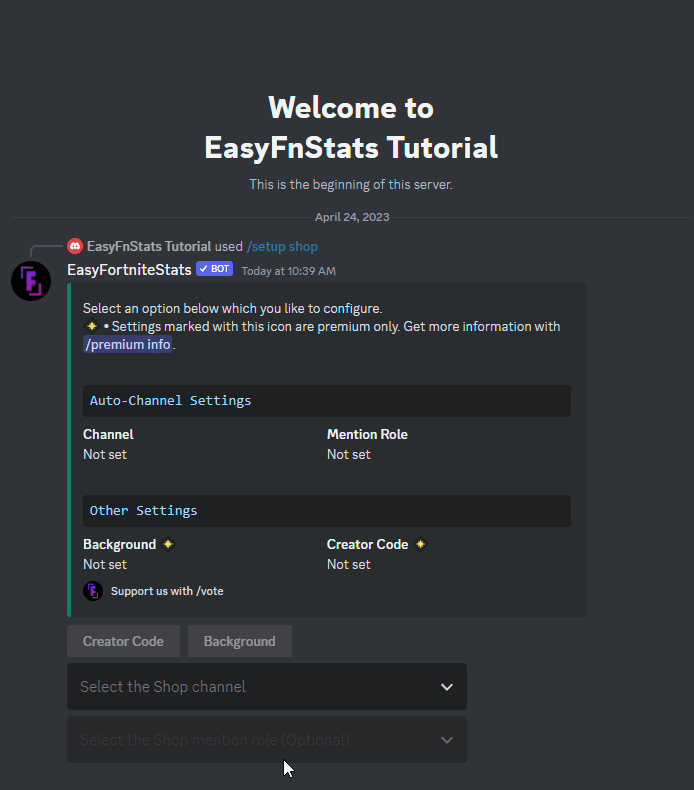
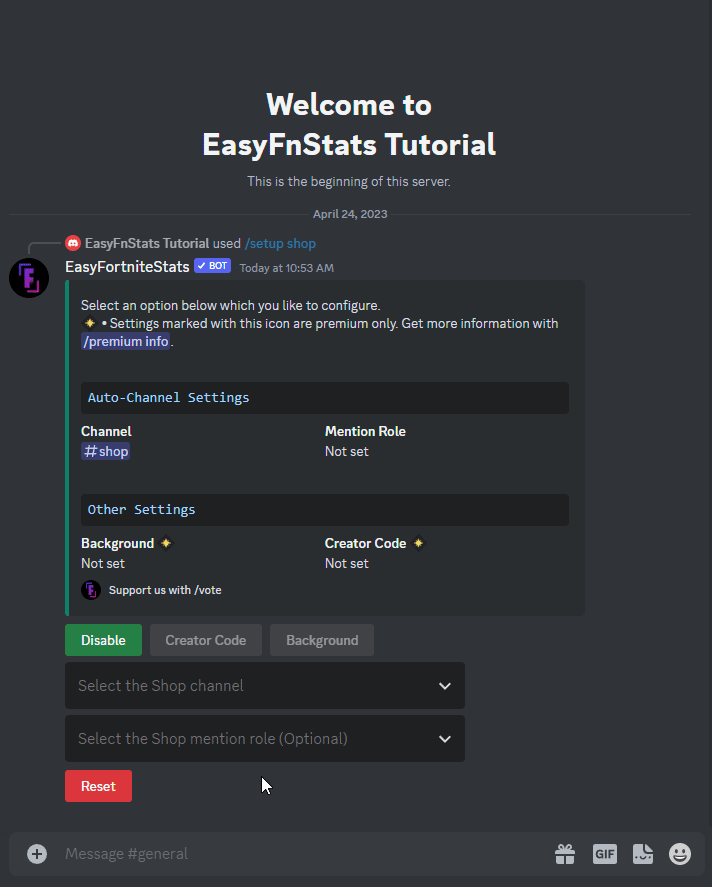
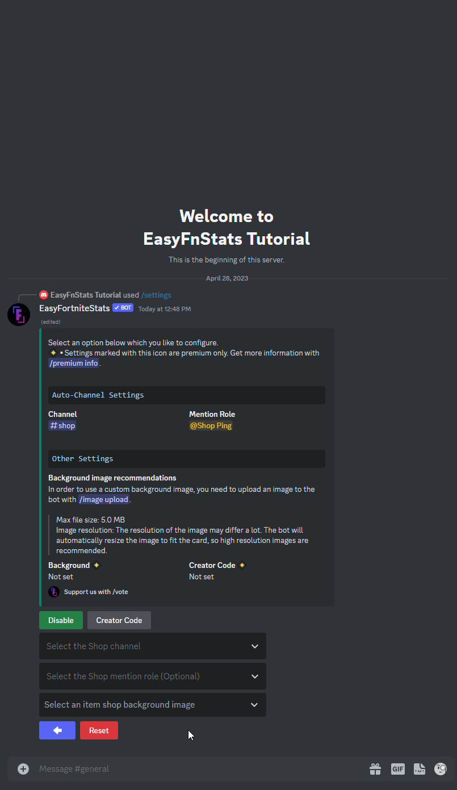
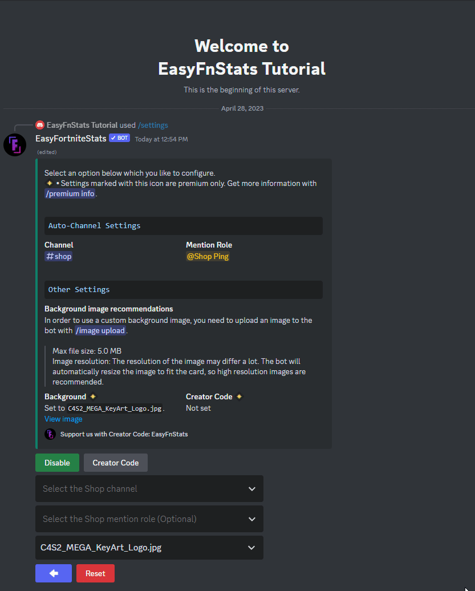
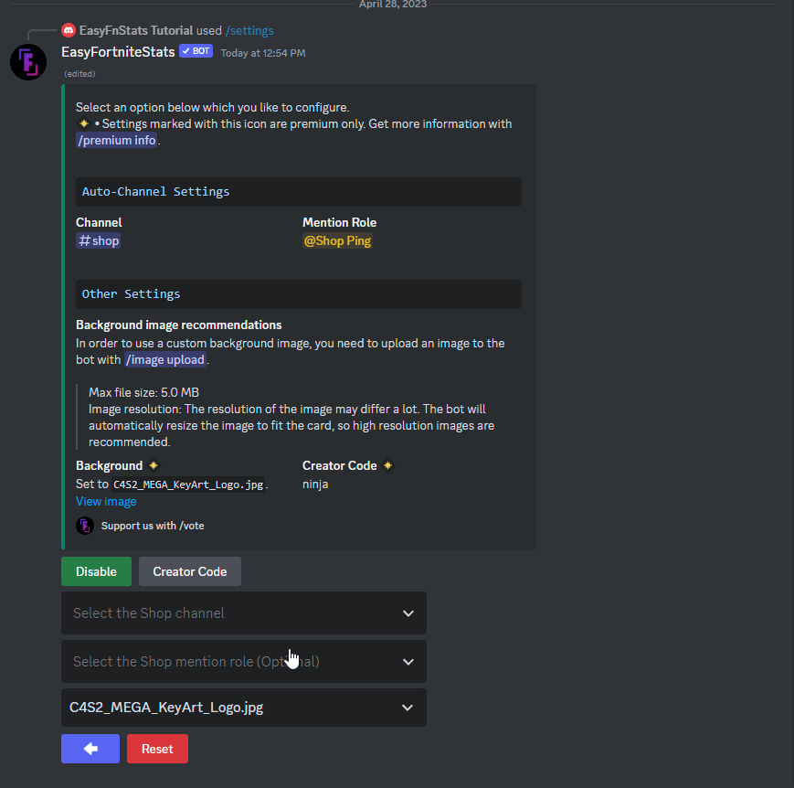

# Item Shop

##  Premium Features

<details>

<summary>Priority Updates</summary>

Your server will receive priority for Item Shop updates. This means updates will arrive up to 45 minutes faster than for non-premium servers.

</details>

<details>

<summary>Custom Background Images</summary>

Set custom background images for Item Shop visuals to give your server a unique look.

</details>

<details>

<summary>No Advertising</summary>

Premium removes all ads related to the bot within the shop image and message, including ads for voting or the creator code.

</details>

<details>

<summary>Custom Creator Code</summary>

Display your custom creator code in the Item Shop image on your server. This applies to automated updates and the `/shop` command.

</details>

## Setup Item Shop updates

If you are using the bot for the first time or you have reset the settings, you have to set up the Item Shop function for the first time.

First, enter the following command:

```
/setup shop
```

Now you need to **select** at least one **channel** where the Item Shop will be broadcast daily. Optionally, you can select a role that should always be mentioned.

### Set Channel

You can set a channel by selecting it from the dropdown menu:

<figure><figcaption><p>Setting the item shop channel</p></figcaption></figure>

#### Possible Errors

* **Missing permissions** **•** The Bot missing permissions. The bot shows you which ones are missing. If you are inexperienced with Discord check out [this guide](https://support.discord.com/hc/en-us/articles/206029707-How-do-I-set-up-Permissions-) to set up permissions.
* **Too Many Webhooks** **•** The selected channel got too many webhooks. You need to delete at least one in the channel settings.

Once you have selected a channel, the item shop is set up. It should now appear in the selected channel.

### Set Mention Role

In addition, you can select a role that should always be mentioned when a new item shop appears. This can be selected via the second dropdown menu as follows:

<figure><figcaption><p>Setting the item shop mention role</p></figcaption></figure>

#### Possible Errors

* **Role mentionable by everyone •** Servers larger than 250 members can't use a role that is mentionable by everyone. This is for security reason to prevent possible abuse. Disable that @everone can mention this role in the server settings.
* **Missing permissions** **•** The Bot missing mention everyone permissions. If you are inexperienced with Discord check out [this guide](https://support.discord.com/hc/en-us/articles/206029707-How-do-I-set-up-Permissions-) to set up permissions.

###  Background Image \[Premium only]

You might want to select a custom background image for the item shop. Therefore you first need to upload an image with `/image upload`. If it falls below the maximum image size specified below, you can select it.&#x20;

* Image Format: `.png`, `.jpg` and `jpeg`
* Recommended Image Resolution: Square-like aspect ratio with dynamic resolution.
* Max. image size: `5MB`

<figure><figcaption><p>Setting a custom Background Image</p></figcaption></figure>

You can also deselect the image from the dropdown menu, which will disable the custom background image.

###  Creator Code \[Premium only]&#x20;

As a premium member, the bots Creator Code will be hidden from the Item Shop image. You my also want to provide your own Creator Code. After Clicking the Creator Code Button, a popup will appear where you can enter the Code in a text field.

<figure><figcaption></figcaption></figure>

#### Possible Errors

* **Creator Code not found •** The given creator code either doesn't exist or is not active&#x20;

Once a Creator Code has been set, the popup always show the current code in the text field. You can disable the code by removing the code from the text field and submitting it.

### Enable/Disable Item Shop updates

You can disable or enable Item Shop posts while keeping all settings. Just click the Enable or Disable button

* If the green Disable button is shown, Server Status posts are currently active
* If the red Enable button is shown, Server Status posts are currently disabled

<figure><figcaption></figcaption></figure>
