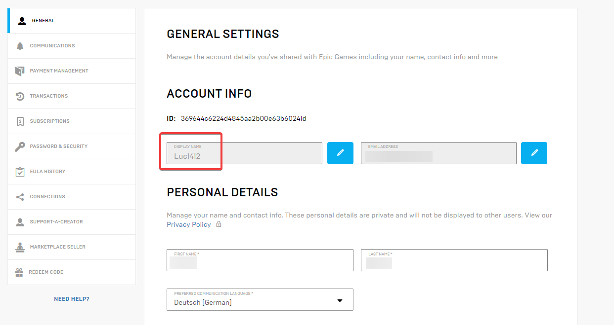

# How to solve verification issues

It seems your verification attempt has failed. Here are some possible solutions to help resolve common issues:

### Wrong Linked Account

You may have linked the wrong Fortnite account. Double-check that you're linking the correct account by using the `/link` command. Ensure you own the account you're trying to verify.

### Wrong Logged-In Account

You might be logged into the wrong Epic Games/Fortnite account. To verify this:

* Visit the [Epic Games website](https://www.epicgames.com).
* Log in with your account details, if needed.
* Check if the account name matches the one you've linked.

If the account details don’t match, log out and sign in with the correct account.

### Other Errors

If the issue persists, it might be due to temporary server problems on Epic Games’ or Fortnite's end. You can visit our [Support Server](https://easyfnstats.com/discord) for further assistance. When reaching out, it’s helpful to provide any error message you may have received in your direct messages.
