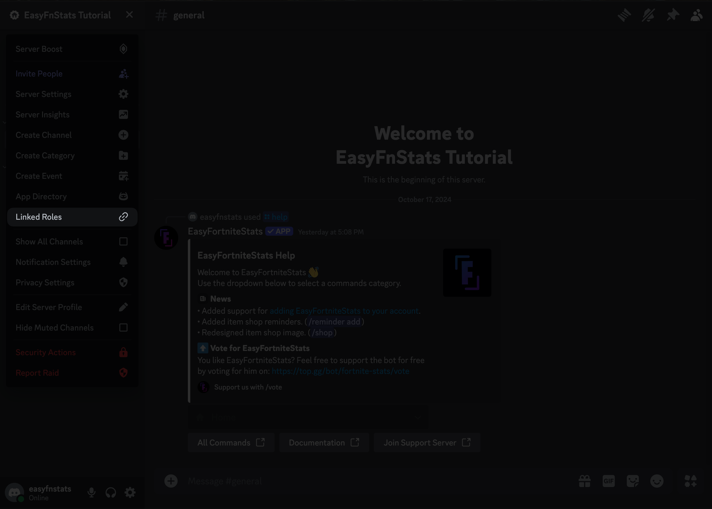

# Successfully linked

### Faster Stats Access

When using the `/stats` command, your linked account will be automatically suggested, making it quicker to retrieve your stats. No more typing your username each time!

### Verified Badge

Every time someone views your stats, a verified badge with your Discord name will be displayed, confirming that you own the Fortnite account.

### Nick Stats Access

You now have access to the **Nick Stats** system, which allows you to display stats like your Battle Pass level or Wins within your Discord nickname. If the server you're on has this feature enabled, you can get started by using the `/nickstats enable` command.

### Linked Roles

You can now take advantage of **Linked Roles**. Some servers offer special roles that require a linked Fortnite account. If available, navigate to **Server Name -> Linked Roles** to claim your roles.

<figure><figcaption></figcaption></figure>

