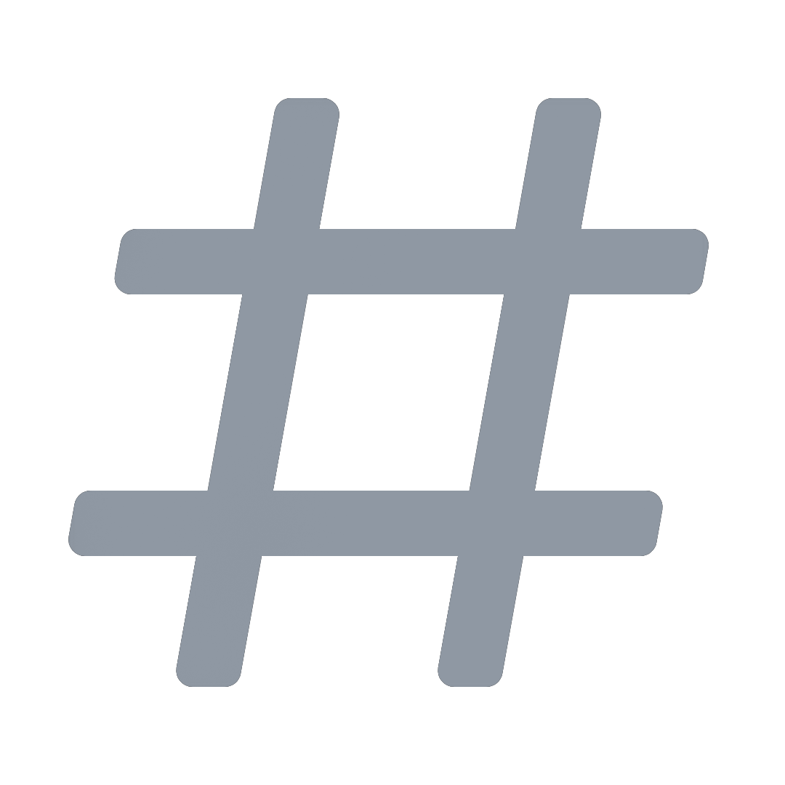
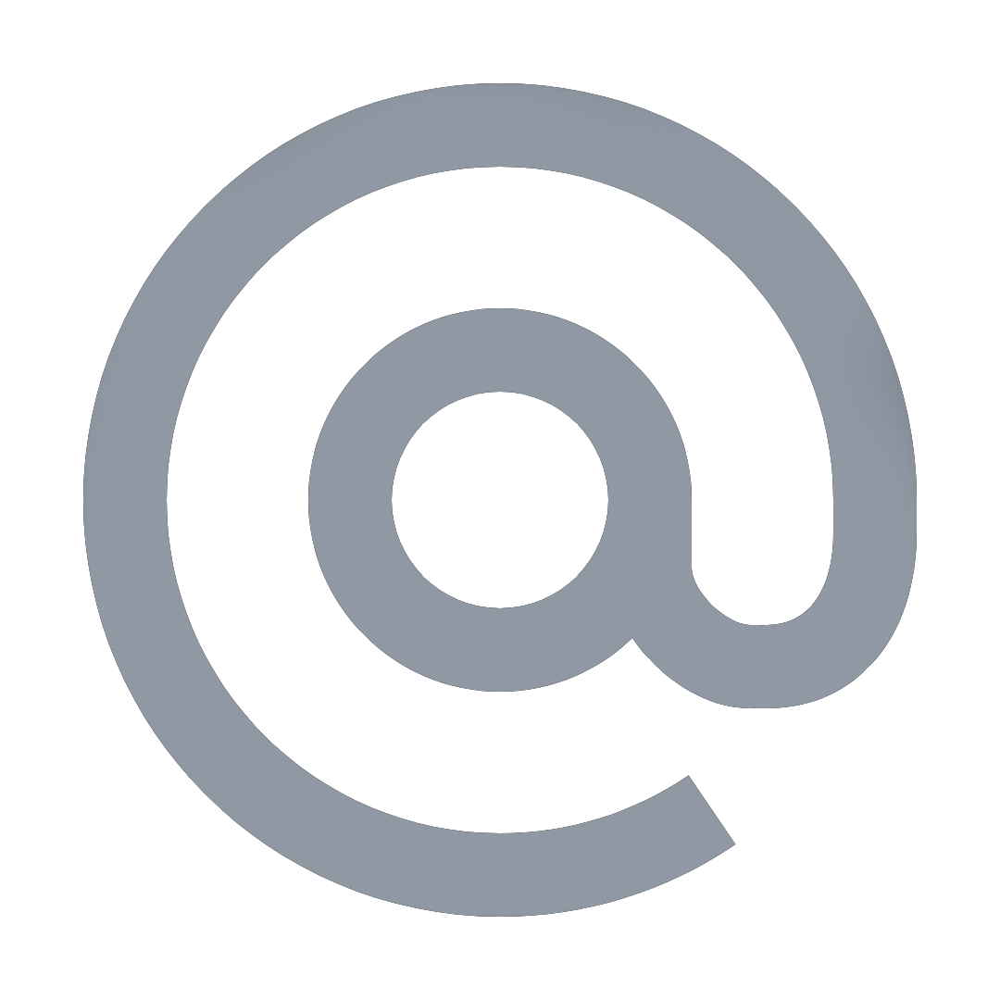

# Item Shop

## Setup Item Shop

### Set channel

First, enter the following command:

```text
!fn shop setup
```

The bot first asks for the channel where the shop should appear. You can either enter the channel **name**, channel **mention** \#channel or insert the channel **ID**. Please send a message just including this information.


If you decide for entering the channel's name, you need to check if the channel name is unique in your server.


#### Possible Errors

* **Channel not found** **•** The given Channel doesn't exist in your server.
* **Missing permissions** **•** The Bot missing permissions. The bot shows you which ones are missing. If you are inexperienced with Discord check out [this guide](https://support.discord.com/hc/en-us/articles/206029707-How-do-I-set-up-Permissions-) to setup permissions.

### Enable mention Role

Now the bot asks whether a role should be mentioned.   
React with ✅ if you like to set up a role. If not react with ❌.

The setup ends if you do not like to set up a mention role.

### Set Mention Role

The bot now asks for a mention role. You can either enter the role **name**, role **mention** \#channel or insert the role **ID**. Please send a message just including this information.


If you decide for entering the role name, you need to check if the role name is unique in your server.


#### Possible Errors

* **Role not found** **•** The given Channel doesn't exist in your server.
* **Role mentionable by everyone •** Servers larger than 250 members can't use a role that is mentionable by everyone
* **Missing permissions** **•** The Bot missing mention everyone permissions. If you are inexperienced with Discord check out [this guide](https://support.discord.com/hc/en-us/articles/206029707-How-do-I-set-up-Permissions-) to setup permissions.

## Modify Item Shop Settings

First, enter the following command:

```text
!fn shop settings
```

A reaction menu will pop up showing you all shop settings. Click the reaction of the setting you like to modify.

###  Set Channel

The bot asks for the channel where the shop should appear. You can either enter the channel **name**, channel **mention** \#channel or insert the channel **ID**. Please send a message just including this information.


If you decide for entering the channel's name, you need to check if the channel name is unique in your server.


#### Possible Errors

* **Channel not found** **•** The given Channel doesn't exist in your server.
* **Missing permissions** **•** The Bot missing permissions. The bot shows you which ones are missing. If you are inexperienced with Discord check out [this guide](https://support.discord.com/hc/en-us/articles/206029707-How-do-I-set-up-Permissions-) to setup permissions.

###  Set Mention Role

The bot asks for a mention role. You can either enter the role **name**, role **mention** \#channel or insert the role **ID**. Please send a message just including this information.


If you decide for entering the role name, you need to check if the role name is unique in your server.


#### Possible Errors

* **Role not found** **•** The given Channel doesn't exist in your server.
* **Role mentionable by everyone •** Servers larger than 250 members can't use a role that is mentionable by everyone
* **Missing permissions** **•** The Bot missing mention everyone permissions. If you are inexperienced with Discord check out [this guide](https://support.discord.com/hc/en-us/articles/206029707-How-do-I-set-up-Permissions-) to setup permissions.

### 🖼 Background Image \[Premium only\]

The bot asks for a background. You need to upload a file wich fulfill the following criteria:

* Image Format: `.png`, `.jpg` and `jpeg`
* Recommended Image Resolution: `1896x1321` - `1896x14666`
* Max. image size: `5MB`

 Please send a message just including the image.

#### Possible Errors

* **Invalid Image Format •** Your provided image has is no valid image format
* **Image too large •** The image size is larger than the given limit

### 🎖 Creator Code \[Premium only\] 

The bot asks for a creator code. The code has to be valid and enabled.

#### Possible Errors

* **Creator Code not found •** The given creator code either doesn't exist or is not active 

### 🗑 Reset

This option reset all settings and disable shop


