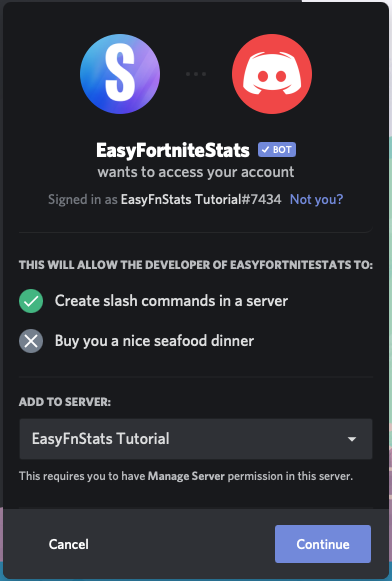
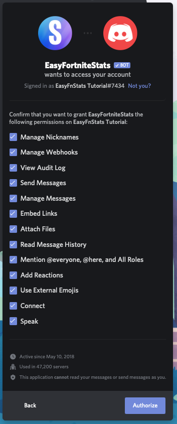

# Invite Bot

1. Visit following site: [https://easyfnstats.com/invite](https://easyfnstats.com/invite)
2. You now may need to login into your account. If you are already logged in, you can skip this step.
3. You now get a drop down list of all servers you got "Manage Server" permissisons in. Select the server of your choice and continue.  

4. A new window pops up with a list of all permissions required by EasyFortniteStats. Feel free to customize this list, but keep in mind that the bot requires all these permissions in order to work properly. Finally, click "Authorize"

5. You now need to solve the Captcha

  
6. The bot should now enter the chosen server.

## Which permissions are required for what reason?

| Permission | Required by |
| :--- | :--- |
| Manage Nicknames | NickStats¹ |
| Manage Webhooks | Automatically Shop, Challenges and Server Status updates |
| View Audit Log | Optional for NickStats¹ |
| Send Messages | All Commands |
| Manage messages | All commands with selections + keep the chat clean |
| Embed Links | Almost every command |
| Read Message History | Automatically Shop, Challenges and Server Status updates |
| Mention @everyone, @here, and All Roles | Automatically Shop, Challenges, and Server Status updates \(when mention role is enabled\) |
| Add reactions | All commands with selections |
| Use External Emojis | Many commands |
| Connect | Fortnite Radio feature |
| Speak | Fortnite Radio feature |

¹ Members can set their BattlePass level or wins in their nickname

