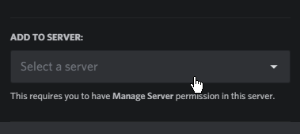
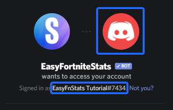

# Invite Bot

### Step one

Visit the following site: [https://easyfnstats.com/invite](https://easyfnstats.com/invite)

### Step two

You should now see a menu like this:

Now tap or click `Select a server`. A drop-down menu should appear including all servers you got`Manage Server` permissions in. Select the server you want the bot to join. Afterwards click **continue**.

### Step three

After selecting a server, you should see something like this:

As long you are not experienced with Discord's permissions system, keep all permissions selected.\
Click the **Authorize** button and complete the **Captcha**. You now should get redirected to [this page](https://docs.easyfnstats.com/invite).

## Invite troubleshooting

### &#x20;I can't find my server. What's the reason?

The main reason for your server not appearing in the drop-down menu is the use of the wrong account. Make sure you're logged into the right account which you can check on the top of the invite screen. You should see your profile picture and Discord tag. If it's the wrong account, press the **Not you?** button.

### Discord asks me to verify my e-mail address.

If you like to add a bot to a server you require an account with a verified e-mail. Head over to your user settings and verify your e-mail.

## Which permissions are required for what reason?

| Permission                              | Required by                                                                              |
| --------------------------------------- | ---------------------------------------------------------------------------------------- |
| Manage Nicknames                        | NickStats¹                                                                               |
| Manage Webhooks                         | Automatically Shop, Challenges and Server Status updates                                 |
| View Audit Log                          | Optional for NickStats¹                                                                  |
| Send Messages                           | All Commands                                                                             |
| Manage messages                         | All commands with selections + keep the chat clean                                       |
| Embed Links                             | Almost every command                                                                     |
| Read Message History                    | Automatically Shop, Challenges and Server Status updates                                 |
| Mention @everyone, @here, and All Roles | Automatically Shop, Challenges, and Server Status updates (when mention role is enabled) |
| Add reactions                           | All commands with selections                                                             |
| Use External Emojis                     | Many commands                                                                            |
| Connect                                 | Fortnite Radio feature                                                                   |
| Speak                                   | Fortnite Radio feature                                                                   |

¹ Members can set their BattlePass level or wins in their nickname
