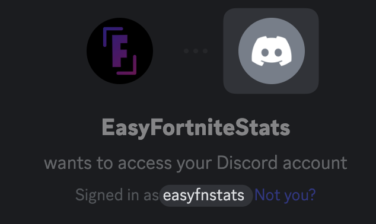

# Install the App

There 2 ways to install EasyFortniteStats:

* Add to My Apps
* Add to Server

In most cases, adding the App to My Apps, is the easiest way to install. It allows you to use the App anywhere with most of it's features.


[account.md](account.md)


If you own or manage a server, you might want to add the app directly to it. This allows you to use the full feature set of EasyFortniteStats to enhance your server.


[server.md](server.md)


## Invite troubleshooting

### &#x20;I can't find my server. What's the reason?

The main reason for your server not appearing in the drop-down menu is the use of the wrong account. Make sure you're logged into the right account which you can check on the top of the invite screen. You should see your profile picture and Discord tag. If it's the wrong account, press the **Not you?** button.

<figure><figcaption></figcaption></figure>

### Discord asks me to verify my e-mail address.

If you like to add a bot to a server you require an account with a verified e-mail. Head over to your user settings and verify your e-mail.

## Which permissions are required for what reason?

| Manage Nicknames                        | NickStats¹                                                                         |
| --------------------------------------- | ---------------------------------------------------------------------------------- |
| Manage Webhooks                         | Automatically Shop, News and Server Status updates                                 |
| View Audit Log                          | NickStats¹ (Optional)                                                              |
| View Channels                           | Any command                                                                        |
| Send Messages                           | Any command                                                                        |
| Send Messages in Threads                | Any command                                                                        |
| Embed Links                             | Any command                                                                        |
| Attach Files                            | Few commands that upload files like images                                         |
| Read Message History                    | Automatically Shop, News and Server Status updates                                 |
| Mention @everyone, @here, and All Roles | Automatically Shop, News, and Server Status updates (when mention role is enabled) |
| Connect                                 | Fortnite Radio feature                                                             |
| Speak                                   | Fortnite Radio feature                                                             |
| Defean Members                          | Fortnite Radio feature                                                             |

¹ NickStats allows members to display stats in their nickname
