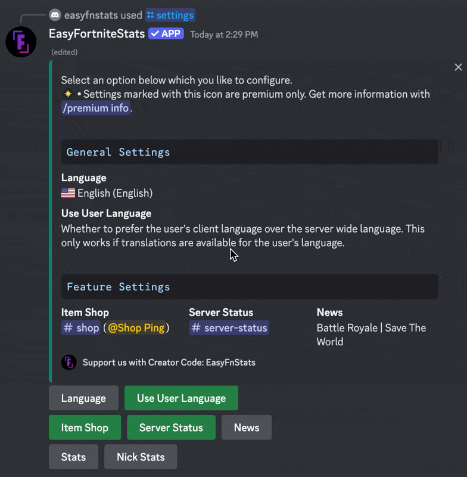
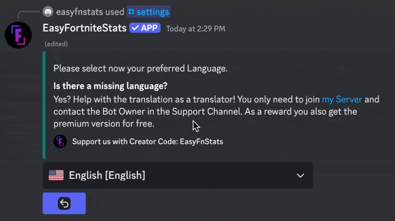
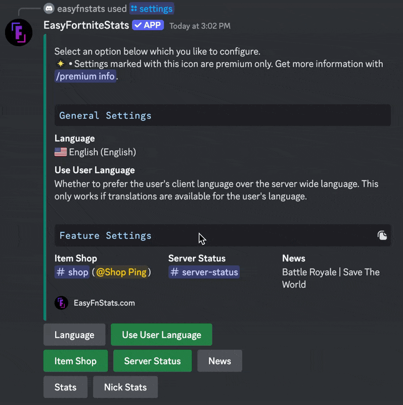

# Language

The bot supports multiple languages, which can be useful during setup or for servers where members predominantly speak a single language. By default, the bot selects the language based on the following priority:

1. The language set by the user in their Discord settings
2. The language configured using the `/settings` command
3. The server's default language set in the community settings

If no translation is available for a selected language, the bot will try the next option in the list, ultimately defaulting to English.


All translations, except for German and English, are community-contributed and may not meet the bot's default quality standards.


## Changing the Language

First, enter the following command to get into the settings menu:

```
/settings
```

Click the **Language** Button:

<figure><figcaption><p>Select the language settings</p></figcaption></figure>

\


A new menu will appear with a dropdown. Select your preferred language from the list:

<figure><figcaption><p>Select a language</p></figcaption></figure>

Once you've completed these steps, the language will be updated successfully.

## Managing User-Specific Language Settings

You can choose to disable or enable the use of the language set in a user’s Discord client. Disabling this option ensures that all messages follow a single language across your server, regardless of individual user settings.

<figure><figcaption><p>Toggle the use of the user's language</p></figcaption></figure>
