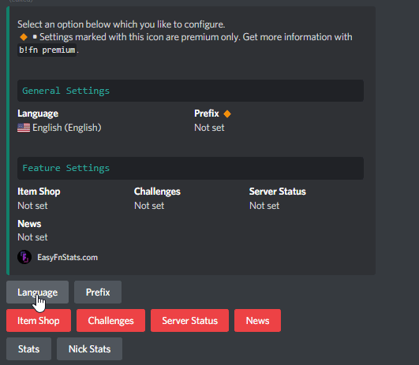
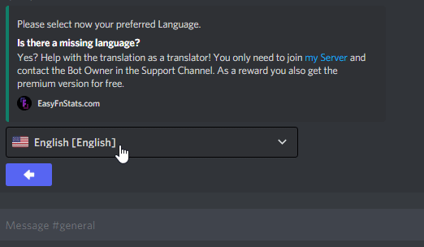

# Language

The bot offers various languages that can be useful when setting up the bot or can be set for communities whose members speak only one specific language.&#x20;


All translations except german are community-based and might not meet the default quality standards.


## Change the language

First, enter the following command to get into the settings menu:

```
!fn settings
```

Click the `Language` Button:



\
Now a further menu will appear. You can click the dropdown to select the language:




The language has now been successfully switched.



