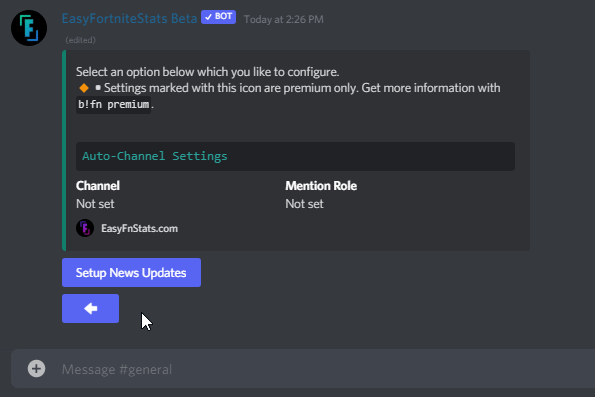
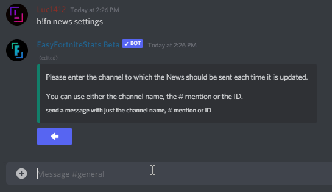
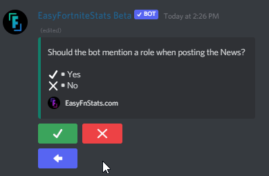
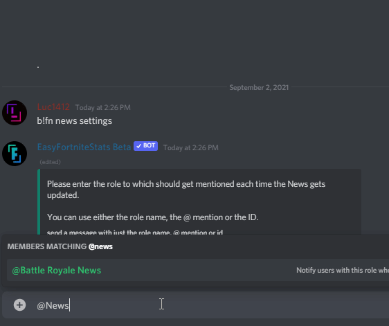
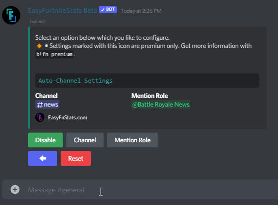
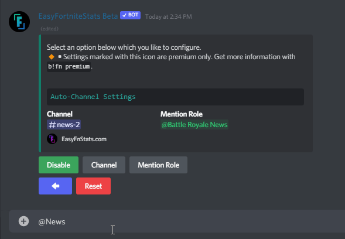
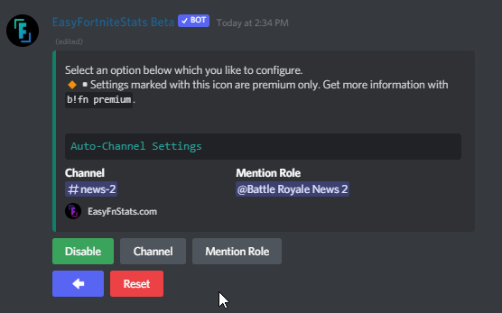

# News

## Setup News updates

If you are using the bot for the first time or you have reset the settings, you have to set up the News function for the first time.

First, enter the following command:

```
/setup news
```

Then click the game mode you like to configure. In this example BattleRoyale News get configured.

Click the blue button to set up News updates. If you can't see this button, you have already set up News. Then you can continue in the [modify News settings section](news.md#modify-news-settings).



The bot asks for the channel where the News should appear. You can either enter the channel **name**, channel **mention** #channel, or insert the channel **ID**. Please send a message just including this information.



#### Possible Errors

* **Channel not found** **•** The given Channel doesn't exist in your server.
* **Missing permissions** **•** The Bot missing permissions. The bot shows you which ones are missing. If you are inexperienced with Discord check out [this guide](https://support.discord.com/hc/en-us/articles/206029707-How-do-I-set-up-Permissions-) to set up permissions.

Once it's done you now can decide whether you like to set up a role that should be mentioned once new News appears.&#x20;

If you don't need this, you can skip this step, press the red X and finish up the News setup.

If you like to continue setting up a News mention role, you can continue by clicking the green checkmark.



The bot asks for a mention role. You can either enter the role **name**, role **mention** #channel or insert the role **ID**. Please send a message just including this information.



It may take up to a few seconds until it finishes the setup.


Automatic News posts have been successfully enabled.


## Modify News Settings

First, enter the following command:

```
/setup news
```

Then click the game mode you like to configure. In this example BattleRoyale News get configured.

### Set Channel

The bot asks for the channel where the News should appear. You can either enter the channel **name**, channel **mention** #channel, or insert the channel **ID**. Please send a message just including this information.



#### Possible Errors

* **Channel not found** **•** The given Channel doesn't exist in your server.
* **Missing permissions** **•** The Bot missing permissions. The bot shows you which ones are missing. If you are inexperienced with Discord check out [this guide](https://support.discord.com/hc/en-us/articles/206029707-How-do-I-set-up-Permissions-) to set up permissions.

### Set Mention Role

The bot asks for a mention role. You can either enter the role **name**, role **mention** #channel, or insert the role **ID**. Please send a message just including this information.



#### Possible Errors

* **Role not found** **•** The given Channel doesn't exist in your server.
* **Role mentionable by everyone •** Servers larger than 250 members can't use a role that is mentionable by everyone
* **Missing permissions** **•** The Bot missing mention everyone permissions. If you are inexperienced with Discord check out [this guide](https://support.discord.com/hc/en-us/articles/206029707-How-do-I-set-up-Permissions-) to set up permissions.

## Enable/Disable News updates

If you already set up the news uppdates you can toggle the function by clicking the first Enable or Disable button.



## Reset Settings

You can reset the following settings:

* Mention Role

You first need to select the setting and press the red Reset button.

You can also reset all settings when you press the button in the settings selection.
