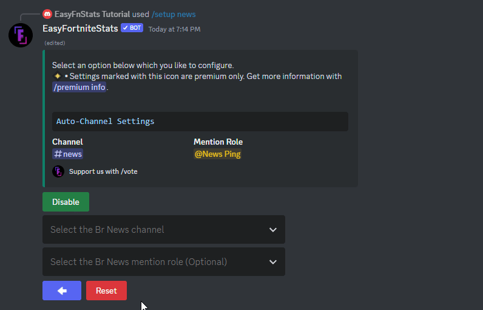

# News

## 🔸Premium features

* **Priority Updates** - Receive news posts in your server up to 10 minutes faster

## Setup News updates

If you are using the bot for the first time or you have reset the settings, you have to set up the News function for the first time.

First, enter the following command:

```
/setup news
```

Then click the game mode you like to configure. In this example BattleRoyale News get configured.

Now you need to **select** at least one **channel** where the News will be broadcast. Optionally, you can select a role that should always be mentioned.

### Set Channel

You can set a channel by selecting it from the dropdown menu:

<figure><figcaption><p>Set News Channel</p></figcaption></figure>

#### Possible Errors

* **Missing permissions** **•** The Bot missing permissions. The bot shows you which ones are missing. If you are inexperienced with Discord check out [this guide](https://support.discord.com/hc/en-us/articles/206029707-How-do-I-set-up-Permissions-) to set up permissions.
* **Too Many Webhooks** **•** The selected channel got too many webhooks. You need to delete at least one in the channel settings.

Once you have selected a channel, the news are set up. It should now appear in the selected channel.

### Set Mention Role

In addition, you can select a role that should always be mentioned when a new news post appears. This can be selected via the second dropdown menu as follows:

<figure><figcaption><p>Set News Mention Role</p></figcaption></figure>

#### Possible Errors

* **Role mentionable by everyone •** Servers larger than 250 members can't use a role that is mentionable by everyone. This is for security reason to prevent possible abuse. Disable that @everone can mention this role in the server settings.
* **Missing permissions** **•** The Bot missing mention everyone permissions. If you are inexperienced with Discord check out [this guide](https://support.discord.com/hc/en-us/articles/206029707-How-do-I-set-up-Permissions-) to set up permissions.

## Enable/Disable News updates

You can disable or enable News posts while keeping all settings. Just click the Enable or Disable button

* If the green Disable button is shown, News posts are currently active
* If the red Enable button is shown, News posts are currently disabled

<figure><figcaption><p>Enable/Disable News</p></figcaption></figure>
