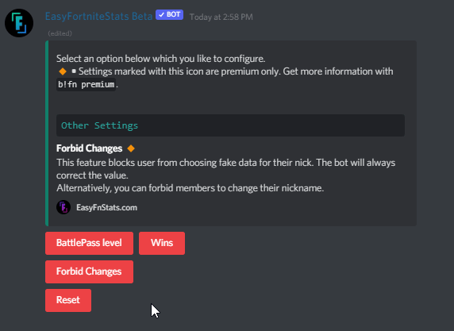
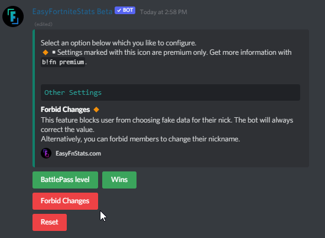

# Nick Stats

## Modify Nick Stats settings

First, enter the following command. It doesn't matter if you like to set up BattlePass Level or Wins: 

```text
!fn bplvl settings
```

### Enable/Disable Nick Stats

Depending on which Nick Stats type you like to set up you can press the appropriate button. Green means enabled, red means disabled.



### 🔸Forbid Changes \[Premium only\]

You can toggle this feature by pressing the button. Green means enabled, red means disabled.



## Reset Settings

You can also reset all settings when you press the button in the settings selection.

