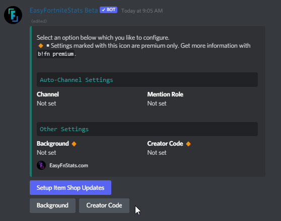
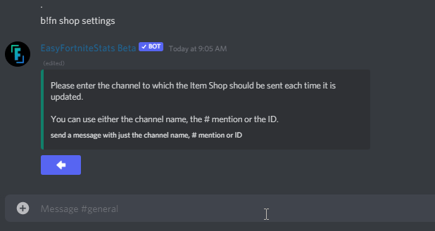
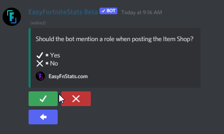
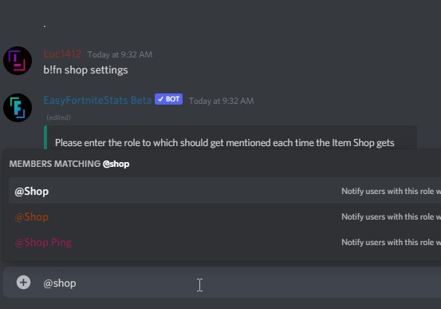
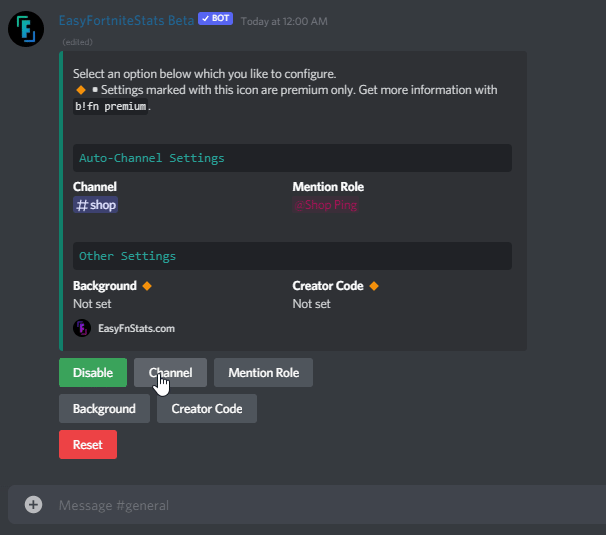
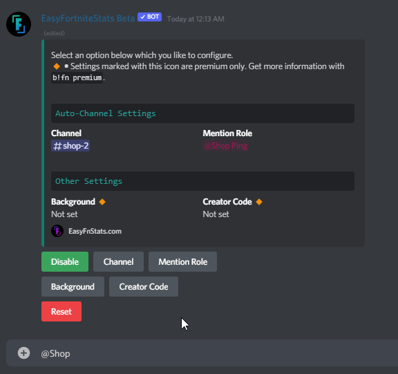
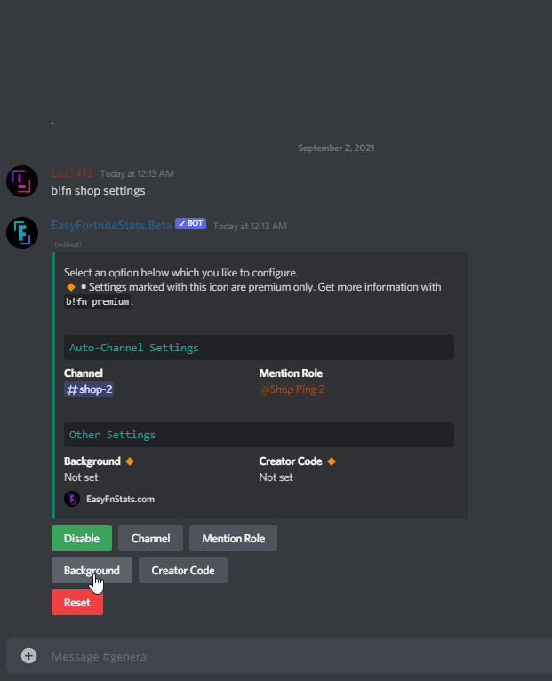
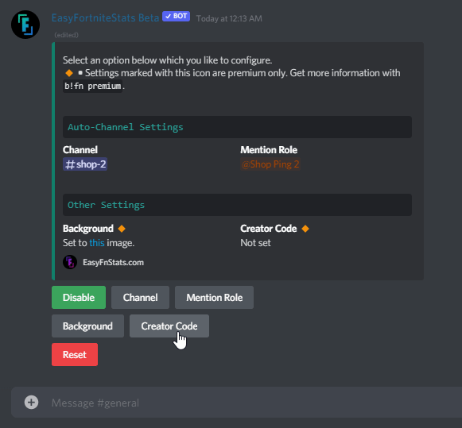
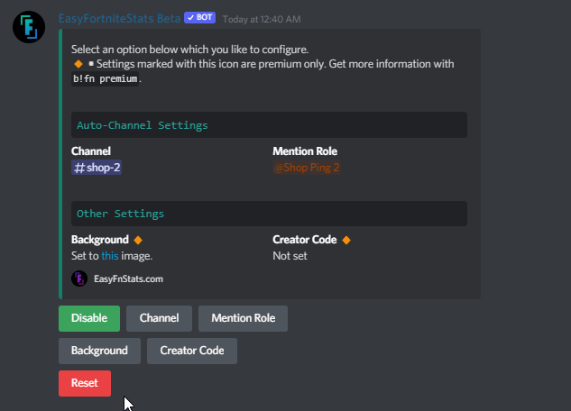

# Item Shop

## Setup Item Shop updates

If you are using the bot for the first time or you have reset the settings, you have to set up the Item Shop function for the first time.

First, enter the following command:

```
/setup shop
```

Click the blue button to set up Item Shop updates. If you can't see this button, you have already set up the Item Shop. Then you can continue in the [modify Item Shop settings section](shop.md#modify-item-shop-settings).



The bot asks for the channel where the Item Shop should appear. You can either enter the channel **name**, channel **mention** #channel, or insert the channel **ID**. Please send a message just including this information.



#### Possible Errors

* **Channel not found** **•** The given Channel doesn't exist in your server.
* **Missing permissions** **•** The Bot missing permissions. The bot shows you which ones are missing. If you are inexperienced with Discord check out [this guide](https://support.discord.com/hc/en-us/articles/206029707-How-do-I-set-up-Permissions-) to set up permissions.

Once it's done you now can decide whether you like to set up a role that should be mentioned once a new Item Shop appears.&#x20;

If you don't need this, you can skip this step, press the red X and finish up the Item Shop setup.

If you like to continue setting up an Item Shop mention role, you can continue by clicking the green checkmark.



The bot asks for a mention role. You can either enter the role **name**, role **mention** #channel or insert the role **ID**. Please send a message just including this information.



It may take up to a few seconds until it finishes the setup.


Automatic Item Shop posts have been successfully enabled.


## Modify Item Shop Settings

First, enter the following command:

```
/setup shop
```

### Set Channel

The bot asks for the channel where the Item Shop should appear. You can either enter the channel **name**, channel **mention** #channel, or insert the channel **ID**. Please send a message just including this information.



#### Possible Errors

* **Channel not found** **•** The given Channel doesn't exist in your server.
* **Missing permissions** **•** The Bot missing permissions. The bot shows you which ones are missing. If you are inexperienced with Discord check out [this guide](https://support.discord.com/hc/en-us/articles/206029707-How-do-I-set-up-Permissions-) to set up permissions.

### Set Mention Role

The bot asks for a mention role. You can either enter the role **name**, role **mention** #channel or insert the role **ID**. Please send a message just including this information.



#### Possible Errors

* **Role not found** **•** The given Channel doesn't exist in your server.
* **Role mentionable by everyone •** Servers larger than 250 members can't use a role that is mentionable by everyone
* **Missing permissions** **•** The Bot missing mention everyone permissions. If you are inexperienced with Discord check out [this guide](https://support.discord.com/hc/en-us/articles/206029707-How-do-I-set-up-Permissions-) to set up permissions.

### :small\_orange\_diamond:Background Image \[Premium only]

The bot asks for a background. You need to upload a file wich fulfill the following criteria:

* Image Format: `.png`, `.jpg` and `jpeg`
* Recommended Image Resolution: `1896x1321` - `1896x14666`
* Max. image size: `5MB`

&#x20;Send a message just including the image.



#### Possible Errors

* **Invalid Image Format •** Your provided image has is no valid image format
* **Image too large •** The image size is larger than the given limit

### :small\_orange\_diamond:Creator Code \[Premium only]&#x20;

The bot asks for a creator code. The code has to be valid and enabled.



#### Possible Errors

* **Creator Code not found •** The given creator code either doesn't exist or is not active&#x20;

## Enable/Disable Item Shop updates

If you already set up the Item Shop updates you can toggle the function by clicking the first Enable or Disable button.



## Reset Settings

You can reset the following settings:

* Mention Role
* Background
* Creator Code

You first need to select the setting and press the red Reset button.

You can also reset all settings when you press the button in the settings selection.
