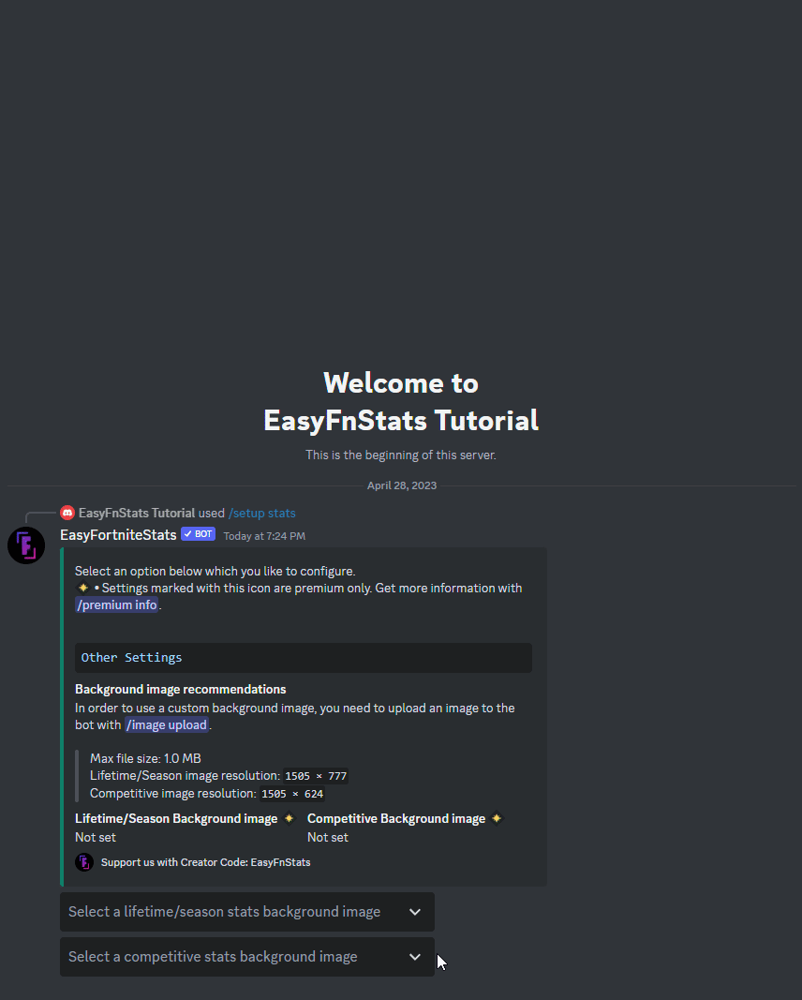

# Stats

## 🔸Premium features

* **Custom Background Image** - Use a custom image as background image for the stats. You can select individual images for lifetime/season and competitive stats.

## Modify Stats Settings

First, enter the following command:

```
/setup stats
```

### :small\_orange\_diamond:Background Image \[Premium only]

You might want to select a custom background image for the stats image. Therefore you first need to upload an image with `/image upload`. If it falls below the maximum image size specified below, you can select it.&#x20;

* Image Format: `.png`, `.jpg` and `jpeg`
* Recommended Lifetime/Season Image Resolution: `1505 × 777`
* Recommended Competitive Image Resolution: `1505 × 624`
* Max. image size: `1MB`

<figure><figcaption></figcaption></figure>

You can also deselect the image from the dropdown menu, which will disable the custom background image.
