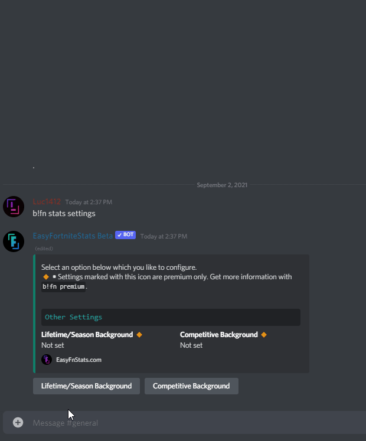

# Stats

## Modify Item Shop Settings

First, enter the following command:

```text
!fn stats settings
```

### 🔸Lifetime/Season Background Image \[Premium only\]

The bot asks for a background. You need to upload a file wich fulfill the following criteria:

* Image Format: `.png`, `.jpg` and `jpeg`
* Recommended Image Resolution: `1505x887`
* Max. image size: `1MB`

 Send a message just including the image.



#### Possible Errors

* **Invalid Image Format •** Your provided image has is no valid image format
* **Image too large •** The image size is larger than the given limit

### 🔸Competitive Background \[Premium only\] 

Please follow the [Lifetime/Season Background instructions](stats.md#lifetime-season-background-image-premium-only).

The only difference is the following image criteria:

* Image Format: `.png`, `.jpg` and `jpeg`
* Recommended Image Resolution: `1505x624`
* Max. image size: `1MB`

## Reset Settings

You can reset the following settings:

* Lifetime/Season Background
* Competitive Background

You first need to select the setting and press the red Reset button.

You can also reset all settings when you press the button in the settings selection.

