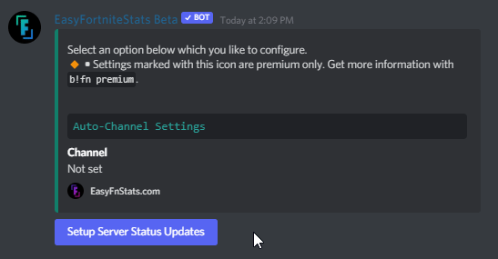
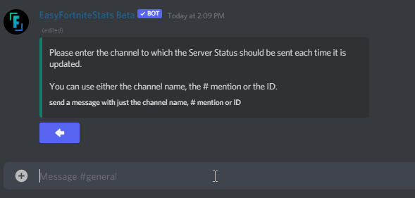
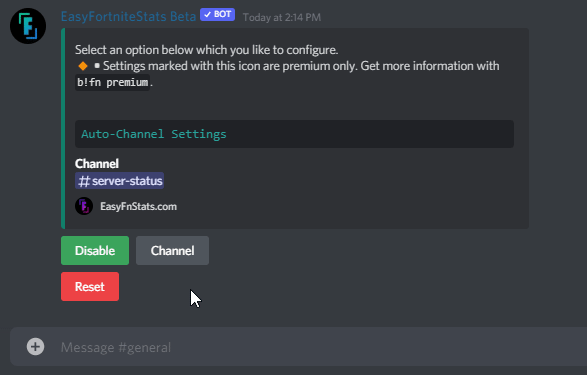
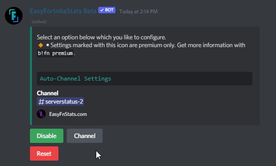

# Server Status

## 🔸Premium features

* **Priority Updates** - Receive server status updates in your server up to 10 minutes faster

## Setup Server Status updates

If you are using the bot for the first time or you have reset the settings, you have to set up the Server Status function for the first time.

First, enter the following command:

```
/setup server-status
```

Click the blue button to set up Server Status updates. If you can't see this button, you have already set up Challenges. Then you can continue in the [modify Server Status settings section](status.md#modify-server-status-settings).



The bot asks for the channel where the Server Status should appear. You can either enter the channel **name**, channel **mention** #channel, or insert the channel **ID**. Please send a message just including this information.



#### Possible Errors

* **Channel not found** **•** The given Channel doesn't exist in your server.
* **Missing permissions** **•** The Bot missing permissions. The bot shows you which ones are missing. If you are inexperienced with Discord check out [this guide](https://support.discord.com/hc/en-us/articles/206029707-How-do-I-set-up-Permissions-) to set up permissions.

It may take up to a few seconds until it finishes the setup.


Automatic Server Status posts have been successfully enabled.


## Modify Server Status Settings

First, enter the following command:

```
/setup server-status
```

### Set Channel

The bot asks for the channel where the Server Status should appear. You can either enter the channel **name**, channel **mention** #channel, or insert the channel **ID**. Please send a message just including this information.



#### Possible Errors

* **Channel not found** **•** The given Channel doesn't exist in your server.
* **Missing permissions** **•** The Bot missing permissions. The bot shows you which ones are missing. If you are inexperienced with Discord check out [this guide](https://support.discord.com/hc/en-us/articles/206029707-How-do-I-set-up-Permissions-) to set up permissions.

## Enable/Disable Server Status updates

If you already set up the Server Status updates you can toggle the function by clicking the first Enable or Disable button.



## Reset Settings

You can also reset all settings when you press the button in the settings selection.
