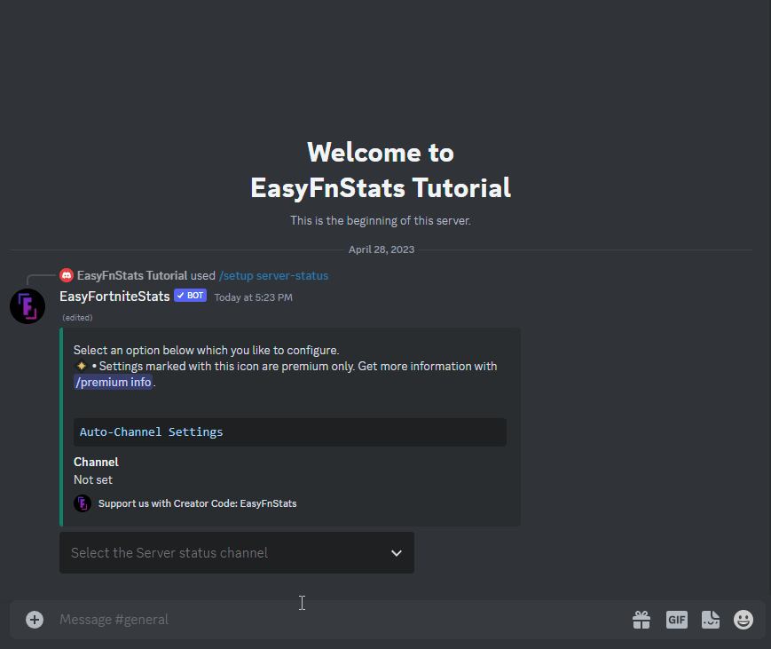
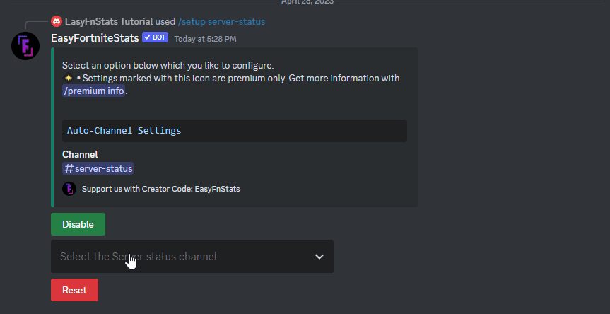

# Server Status

## 🔸Premium features

* **Priority Updates** - Receive server status updates in your server up to 10 minutes faster

## Setup Server Status updates

If you are using the bot for the first time or you have reset the settings, you have to set up the Server Status function for the first time.

First, enter the following command:

```
/setup server-status
```

Now you need to **select** at least one **channel** where the Server Status will be broadcast. 

### Set Channel

You can set a channel by selecting it from the dropdown menu:

<figure><figcaption><p>Set Server Status Channel</p></figcaption></figure>

#### Possible Errors

* **Missing permissions** **•** The Bot missing permissions. The bot shows you which ones are missing. If you are inexperienced with Discord check out [this guide](https://support.discord.com/hc/en-us/articles/206029707-How-do-I-set-up-Permissions-) to set up permissions.
* **Too Many Webhooks** **•** The selected channel got too many webhooks. You need to delete at least one in the channel settings.

Once you have selected a channel, the server status is set up. It should now appear in the selected channel.

### Enable/Disable Server Status updates

You can disable or enable Server Status posts while keeping all settings. Just click the Enable or Disable button.

<figure><figcaption></figcaption></figure>
