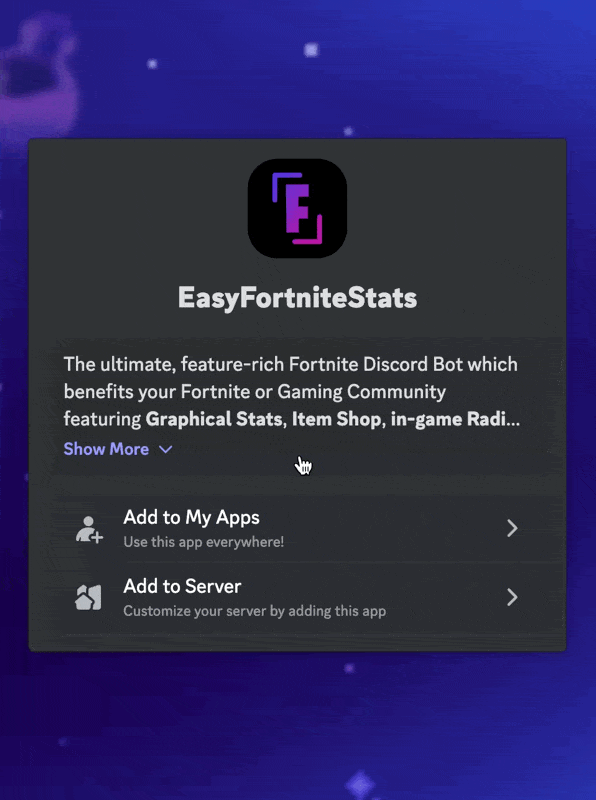
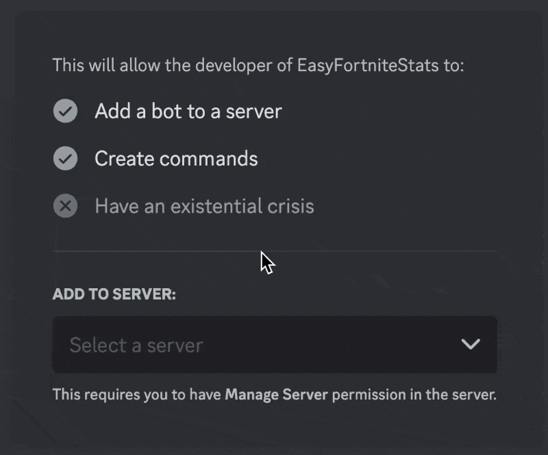
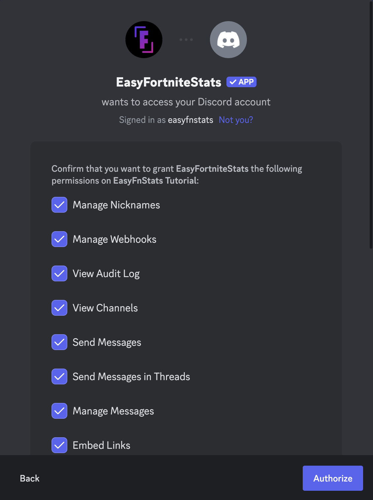

# Add to Server

### Step 1

Visit [easyfnstats.com/invite](https://easyfnstats.com/invite)

### Step 2

Click **Add to Server**

<figure><figcaption></figcaption></figure>

Now click **Select a server**. A drop-down menu should appear including all servers you got `Manage Server` permissions in. Select the server you want the bot to join. Afterwards click **Continue**.

<figure><figcaption></figcaption></figure>

### Step three

After selecting a server, you should see something like this:

<figure><figcaption></figcaption></figure>

As long you are not experienced with Discord's permissions system, keep all permissions selected.\
Click the **Authorize** button and complete the **Captcha**. You now should get redirected to [this page](https://docs.easyfnstats.com/invite).
